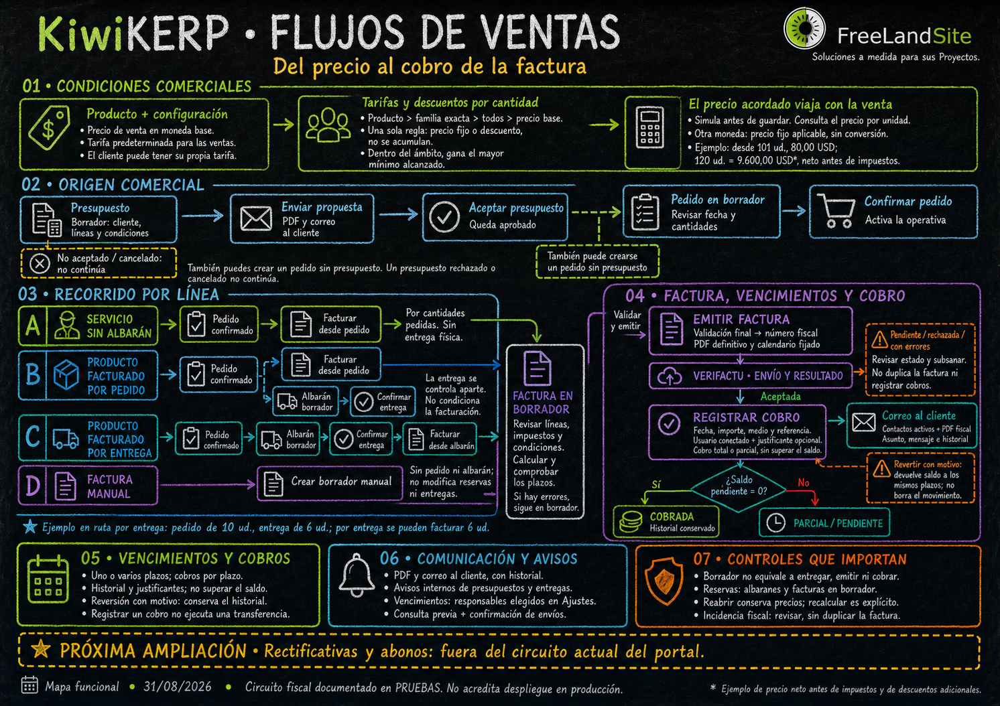
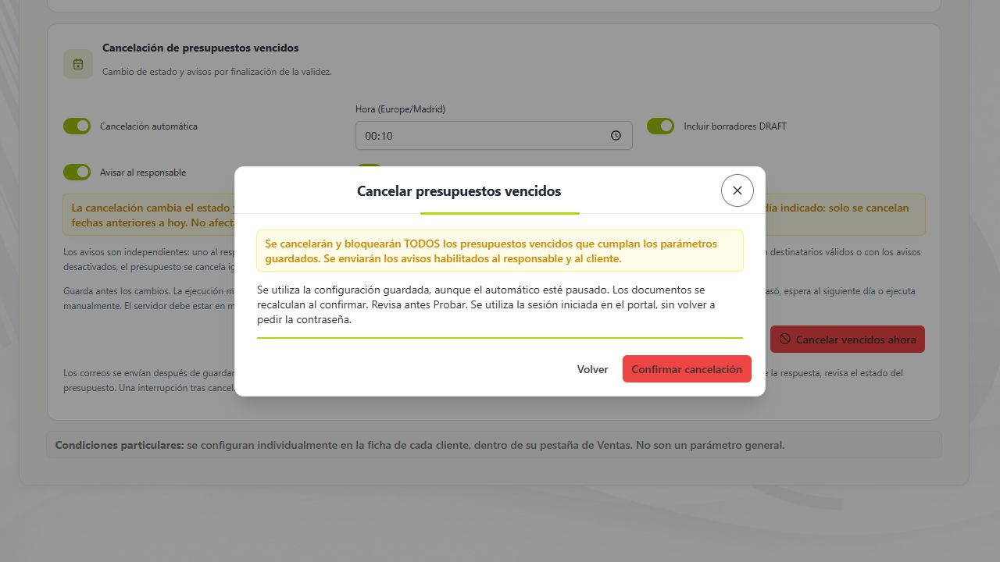
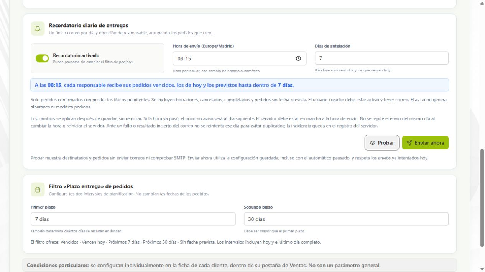
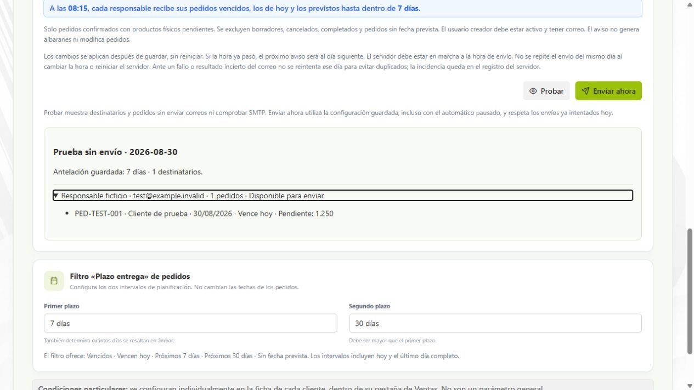
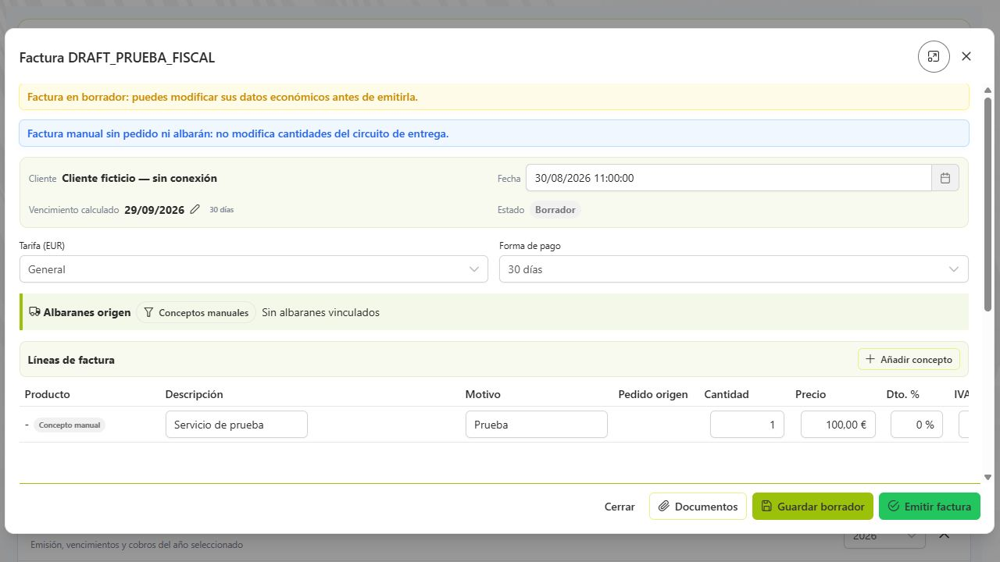
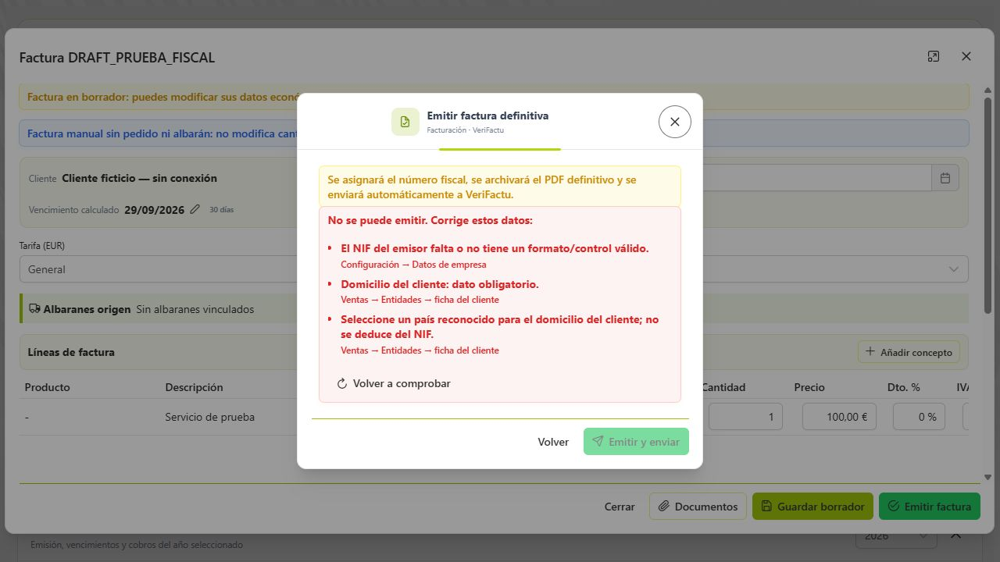
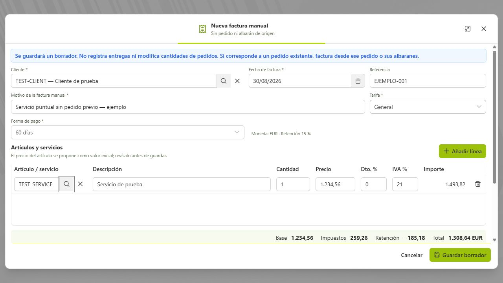
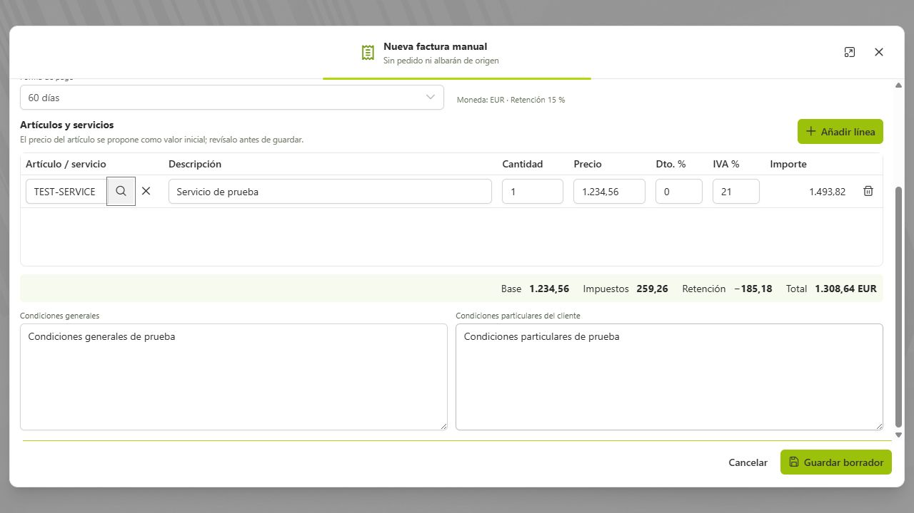

# Manual de usuario de KiwiK ERP

**Versión:** 2.7
**Última actualización:** 1 de septiembre de 2026

Este manual explica el funcionamiento de KiwiK ERP desde el punto de vista del usuario. Se actualizará conforme se incorporen nuevas funciones o cambien los procesos existentes.

## Introducción: qué es KiwiK ERP

KiwiK ERP es un sistema de gestión empresarial que reúne en un mismo entorno la información de clientes, artículos y operaciones comerciales. ERP significa planificación de recursos empresariales. En KiwiK, el trabajo disponible se centra en seguir una venta desde la propuesta inicial hasta la entrega, la factura y su cobro.

Su finalidad es evitar volver a introducir los mismos datos en cada documento y permitir consultar el origen de una operación. Un pedido puede proceder de un presupuesto; sus entregas se registran en albaranes; las facturas conservan las referencias correspondientes y los cobros se consultan en su historial.

### A quién va dirigido

- **Administración y ventas:** mantener clientes, preparar propuestas, confirmar pedidos y revisar la facturación.
- **Personal que gestiona entregas:** preparar albaranes, confirmar salidas y conservar justificantes de recogida.
- **Personal que registra cobros:** anotar pagos recibidos, consultar saldos y corregir movimientos mediante reversión.
- **Administradores:** configurar empresa, usuarios, datos maestros y parámetros de ventas. Estos perfiles describen tareas de trabajo; no equivalen a una matriz de permisos independiente para cada acción.

### Qué incluye y cuáles son sus límites

El manual describe las funciones implementadas en el proyecto a 1 de septiembre de 2026. La instalación debe tener frontend, backend y actualizaciones de base de datos compatibles para utilizarlas. Compras e Informes siguen identificados como áreas en preparación; no debe interpretarse su tarjeta como una función disponible.

El circuito fiscal descrito está configurado para **PRUEBAS**. Esta guía explica botones y resultados de la aplicación; no acredita una puesta en producción ni sustituye la revisión de los requisitos de la empresa. Las rectificativas, remesas, conciliación y gestión de impagados no forman parte del flujo básico actualmente documentado.

### Cómo leer este manual

Empiece por acceso, clientes y artículos si es la primera vez que utiliza el sistema. Para una operación diaria, vaya directamente al apartado del documento que está gestionando. Antes de confirmar una entrega o emitir una factura, revise su efecto: **guardar un borrador no equivale a confirmar, emitir ni cobrar**. Las capturas son referencias visuales y pueden mostrar otra marca o configuración de empresa.

Las capturas nuevas proceden de los formularios reales con datos ficticios en un entorno aislado, sin emitir facturas ni enviar correos. Pulse las imágenes del portal para ampliarlas. En la copia Markdown conserve la carpeta imagenes junto al documento: las imágenes no dependen de archivos temporales.

## Índice

Guía específica: [Lista de precios y tarifas de venta](lista-precios.md).

Estado de cierre: [Auditoría de Ventas del 31/08/2026](../auditoria-cierre-ventas-2026-08-31.md).

Novedades: [Trazabilidad, asistentes y mejoras de uso](#novedades-del-1-de-septiembre-de-2026).

Mapa visual: [Diagrama de los flujos de ventas](#diagrama-de-los-flujos-de-ventas).

Guía específica: [Requerimientos y documentación AEAT](requerimientos-aeat.md).

Guía específica: [Facturación desde pedido y cierre por línea](facturacion-desde-pedido.md).

Guía específica: [Crear una factura manual](factura-manual.md).

- [Introducción al sistema](#introducción-qué-es-kiwik-erp)
- [Puesta en marcha e instalación](#puesta-en-marcha-e-instalación)

1. [Acceso al sistema](#1-acceso-al-sistema)
2. [Panel de control](#2-panel-de-control)
3. [Área comercial](#3-área-comercial)
4. [Entidades](#4-entidades)
5. [Artículos](#5-artículos)
6. [Presupuestos](#6-presupuestos)
7. [Pedidos de venta](#7-pedidos-de-venta)
8. [Albaranes y entregas](#8-albaranes-y-entregas)
9. [Facturas de venta](#9-facturas-de-venta)
10. [Facturas proforma](#10-facturas-proforma)
11. [Configuración del sistema](#11-configuración-del-sistema)
12. [Glosario de estados](#12-glosario-de-estados)

---

## Diagrama de los flujos de ventas

[](diagramas/flujo-ventas-pizarra-tiza-2026-08-31.png)

[Abrir el diagrama PNG para ampliar o descargar](diagramas/flujo-ventas-pizarra-tiza-2026-08-31.png).

El mapa comienza con precio base, tarifa del cliente, descuentos y tramos por cantidad. Distingue servicios sin albarán, productos facturados por pedido o por entrega y facturas manuales. Incluye emisión, VeriFactu, correo, vencimientos, recordatorios, cobros parciales y reversión. Las rectificativas aparecen como pendientes, fuera del flujo actual.

Mapa revisado el **31/08/2026**, con circuito fiscal documentado en **PRUEBAS**. La nueva pizarra negra de tiza, sin marco, es una imagen de 1492 × 1054 píxeles para pantalla. Se conserva el [PDF A1 del diseño anterior](../../output/pdf/kiwikerp-ventas-pizarra-a1-2026-08-31.pdf), de 841 × 594 mm, con texto y trazos vectoriales, reducible a A2. Ese PDF no tiene el nuevo acabado visual. La nueva imagen necesita una adaptación de resolución/arte final antes de imprimirse como póster A1; no basta con ampliar el PNG. Conserve `diagramas` y el PDF al distribuir este manual.

**Mantenimiento:** al actualizar la documentación, revisar también este diagrama. Si cambian pasos, estados, reglas o conexiones del circuito, actualizar la imagen y sus referencias tanto aquí como en el manual del portal. Véase [la guía de mantenimiento del diagrama](diagramas/README.md).

## Puesta en marcha e instalación

Cuando KiwiKERP no encuentra una identidad de instalación válida, el portal abre el asistente de puesta en marcha en lugar del acceso habitual. La detección no depende de que las tablas contengan datos: utiliza dos archivos externos a la aplicación que deben conservarse juntos:

```text
<KIWIKERP_DATA_DIR>/installation/installation.properties
<KIWIKERP_DATA_DIR>/installation/installation.key
```

Sin `KIWIKERP_DATA_DIR`, en Windows se utiliza por defecto `%USERPROFILE%\.kiwikerp`; por ejemplo, `C:\Users\usuario\.kiwikerp`. En Linux se utiliza el directorio personal del usuario que ejecuta el servidor, bajo `.kiwikerp`. `KIWIK_INSTALLATION_FILE` permite indicar directamente otra ubicación para `installation.properties`; la clave se guarda a su lado. No copie uno de los dos archivos por separado ni publique su contenido.

Como segunda protección, la base de datos registra su identidad en `kiwikerp_installation`. La aplicación sólo considera nueva una instalación cuando faltan los archivos externos, la base está disponible y no contiene la marca ni tablas de la aplicación. Si se borra uno o ambos archivos de una instalación completada, KiwiKERP los vuelve a crear con una clave nueva y conserva el mismo `installation_id` registrado en la base. Si la recuperación no puede escribirse, hay tablas sin marca, la base no responde o las identidades no coinciden, el instalador se bloquea; nunca interpreta esa situación como permiso para borrar datos.

El primer paso comprueba visualmente la disponibilidad del servidor, la conexión con la base de datos y la posibilidad de crear y proteger la identidad externa. **Continuar** permanece desactivado mientras una comprobación esté pendiente o haya fallado. Si el servidor de KiwiKERP no responde, se muestra una pantalla corporativa de servicio no disponible con la opción de volver a intentarlo; no se envía al usuario al acceso como si la instalación estuviera operativa.

Después se solicitan los datos esenciales de la empresa, NIF/CIF, contacto, dirección, logotipo y el primer administrador. El repositorio documental predeterminado es `<KIWIKERP_DATA_DIR>/gestdoc`; si no existe, KiwiKERP intenta crearlo. La instalación sólo puede continuar si la carpeta permite lectura y escritura al usuario que ejecuta el servidor.

### Base de datos y esquema inicial

El esquema de referencia para una instalación limpia se mantiene en el backend, en `BackUpBBDD/SchemaEmptyBBDD/BBDD.sql`. El responsable del proyecto debe conservarlo actualizado. Que actualmente contenga datos provisionales no cambia la regla: se ejecutará exactamente el contenido preparado en ese archivo.

**Estado actual:** el flujo automático de copia y recreación final todavía está pendiente de implementación. El comportamiento acordado será: comprobar el esquema; crear un dump fechado en `<KIWIKERP_DATA_DIR>/backups`; verificar que el dump terminó correctamente y no está vacío; recrear la base; ejecutar el esquema; guardar empresa y administrador; y sólo entonces marcar la instalación como completada. Si el dump falla, la base existente no debe borrarse ni modificarse. Hasta que este flujo esté implementado y probado con una base real, no utilice el botón final como sustituto de una copia de seguridad administrada.

### GestDoc después de instalar

La ruta activa aparece discretamente al extremo derecho del pie del portal, antes del logo y la versión: `GestDoc · ruta`. Un administrador puede cambiarla en **Configuración / Ajustes → Preferencias → Repositorio documental**. La ruta debe ser absoluta, existir y permitir lectura y escritura. Guardar otra ruta no mueve los documentos históricos, facturas, adjuntos, imágenes ni logotipos existentes. Conserve la ubicación anterior y traslade los archivos de forma controlada.

La configuración se guarda inmediatamente, pero actualmente es necesario reiniciar el servidor de KiwiKERP para que las direcciones públicas de imágenes y documentos se registren con la nueva ubicación. Después compruebe un documento histórico, un adjunto, una imagen y un PDF antes de retirar la carpeta anterior.

### Correo y sesión administrativa

**Verificar conexión** en la configuración SMTP realiza una conexión y autenticación con los valores del formulario, sin enviar un correo. La petición utiliza la sesión iniciada en el portal mediante `X-Portal-Session`; sólo un administrador activo puede ejecutarla. Si la sesión ha caducado o el servidor se ha reiniciado, cierre la sesión y vuelva a entrar antes de repetir la prueba. No confunda una verificación SMTP correcta con la entrega de un mensaje a un destinatario.

## Novedades del 1 de septiembre de 2026

- **Trazabilidad comercial** desde Presupuestos, Pedidos, Albaranes y Facturas, con recorrido visual hasta los cobros, conservación de ramas e impresión.
- **Asistente de Pedidos** de solo lectura para consultar seguimiento, pendientes y fechas previstas, y explicar un pedido línea por línea.
- Los asistentes permiten localizar el cliente mediante el selector habitual y separan los totales por moneda, sin conversiones ni sumas engañosas.
- Tarifas por producto, familia o catálogo, descuentos por cantidad y simulación con cambios sin guardar.

### Tarifas de venta: del precio base al precio acordado

**Ventas → Lista de precios** centraliza las tarifas. **Ajustes de ventas → Tarifas de venta** abre esa misma pantalla; no mantiene una configuración duplicada. En el panel inferior se eligen la moneda base del Precio de venta de los artículos y la tarifa predeterminada. Solo se puede elegir como predeterminada una tarifa de la moneda base. La tarifa asignada al cliente permite pactar otras condiciones sin cambiar el producto para todos.

| Elemento | Función |
| --- | --- |
| Precio de venta del artículo | Precio base en la moneda configurada. |
| Tarifa predeterminada | Referencia general cuando no existe otra tarifa aplicable. |
| Tarifa del cliente | Condiciones propuestas en sus nuevas ventas; varios clientes pueden compartirla. |
| Regla por producto, familia o todos | Precio fijo o descuento sobre el precio base; una única regla, sin acumulación. |
| Cantidad mínima | Selecciona el mayor tramo alcanzado dentro del ámbito aplicable, por línea. |
| Precio del documento | Importe acordado que se guarda; reabrir no lo recalcula. |

Se prioriza **producto → familia exacta → todos → precio base**. Sin una regla aplicable, el precio base solo se utiliza en su propia moneda. Una tarifa USD no convierte el precio EUR: requiere un precio fijo aplicable en USD. No se puede cambiar la moneda de una tarifa existente; cree otra para evitar reinterpretar importes.

**Ejemplo:** el producto tiene un precio base de 5,00 EUR. El cliente utiliza una tarifa USD con 100,00 USD desde 0 unidades y 80,00 USD desde 101. Una línea de 120 unidades propone **80,00 USD por unidad**, con base neta de **9.600,00 USD**, antes de impuestos y de descuentos adicionales. No son 80,00 USD por toda la línea ni una conversión de los 5,00 EUR.

**Simular precio con las reglas del formulario** utiliza incluso cambios sin guardar. No modifica la tarifa; al editar las reglas se descarta el resultado anterior. Desde el artículo, **Consultar tarifas** usa las reglas guardadas.

**Aplicar tarifa** requiere confirmación, recalcula todas las líneas y pone a cero sus descuentos adicionales. Cambiar cantidades recalcula solo las líneas gestionadas por tarifa durante esa edición. Los precios guardados o manuales no se actualizan automáticamente. Conservar importes al cambiar tarifa solo es posible si la moneda coincide.

### Origen del precio y presentación

La columna **Precio** del presupuesto es más amplia y muestra el origen. La corrección para conservarlo tras guardar/reabrir presupuestos y pedidos requiere **V28 y backend actualizado**. V28 se aplicó y verificó el 31/08/2026; queda comprobar el backend actualizado y guardar/reabrir en el portal. Con esa versión, una edición real indica **Precio manual**, y las líneas antiguas sin evidencia muestran **Precio guardado**. El simple enfoque del campo no debe cambiar su origen.

- Lista de precios utiliza el menú de acciones **…**, tabla corporativa, tipografía ampliada y editor con cabecera común.
- Los importes y cantidades de tarifas usan **punto de miles y coma decimal**: 1.200,00 y 80,00; no confundir 1.200 con 1,2.
- Nueva tarifa, Nueva entidad, Nuevo artículo, Nuevo presupuesto y Nuevo pedido comparten verde corporativo claro. En Presupuestos y Pedidos, Nuevo queda al final de la barra. Albaranes conserva su estilo.
- El panel Tarifas de venta de Ajustes comparte icono, cabecera, tipografía y alineación de acciones con los demás paneles.

### Qué falta para cerrar Ventas

Las **rectificativas y abonos** son la siguiente ampliación funcional del portal. No basta con cambiar el estado de la factura ni con revertir un cobro. Además, antes de producción, deben cerrarse la autenticación/permisos de cobros, la validación del backend tras V28 (ya aplicada) y una prueba integral con persistencia, concurrencia y fiscalidad en pruebas. El [informe de auditoría](../auditoria-cierre-ventas-2026-08-31.md) distingue estos bloqueos de ampliaciones futuras como remesas o conciliación.

## 1. Acceso al sistema

La pantalla de acceso identifica visualmente la empresa y muestra el logotipo del cliente cuando está configurado.

### 1.1 Iniciar sesión


Para acceder a KiwiK ERP:

1. Introduzca su nombre de usuario en el campo **Usuario**.
2. Escriba su clave de acceso en el campo **Contraseña**. Puede pulsar el icono con forma de ojo para mostrar u ocultar temporalmente la contraseña.
3. Pulse **Acceder a KiwiKERP**.
4. Una vez validadas las credenciales, el sistema abrirá el panel de control.

Si el sistema rechaza el acceso, compruebe que el usuario y la contraseña sean correctos y que no esté activado el bloqueo de mayúsculas. Los mensajes distinguen entre campos obligatorios, credenciales incorrectas y problemas de conexión.

Antes de introducir sus credenciales, compruebe que utiliza la dirección de acceso facilitada por su administrador y una conexión HTTPS válida. No comparta su contraseña ni la deje anotada en un lugar accesible a otras personas.

En la parte inferior se muestra el enlace del desarrollador, **FreeLandSite**.

### 1.2 Recuperar las credenciales

Si no recuerda su contraseña:

1. Pulse **¿La has olvidado?** junto al campo Contraseña.
2. Introduzca la dirección de correo asociada a su usuario.
3. Pulse **Enviar instrucciones**.
4. Cuando aparezca la confirmación, revise la bandeja de entrada de esa cuenta.
5. Abra el mensaje **Acceso a KiwiKERP** y utilice la contraseña indicada para iniciar sesión.

El correo se envía únicamente cuando la dirección pertenece a un usuario registrado y tiene un email configurado. Si la aplicación no puede procesar la solicitud, compruebe que la dirección esté escrita correctamente o contacte con el administrador del sistema.

Si el mensaje no aparece, revise las carpetas de correo no deseado, promociones o cuarentena. El tiempo de recepción también puede depender del servidor de correo de la empresa.

Por seguridad:

- No reenvíe el mensaje de recuperación ni comparta su contenido.
- Cambie la contraseña desde la configuración del usuario después de recuperar el acceso.
- Si no solicitó ese correo, comuníquelo al administrador.
- Cierre la sesión cuando utilice un equipo compartido.

### 1.3 Problemas frecuentes de acceso

- **Usuario o contraseña inválidos:** revise mayúsculas, minúsculas y espacios introducidos accidentalmente.
- **Usuario desactivado:** solicite al administrador que compruebe el estado de su cuenta.
- **Correo no reconocido:** confirme que utiliza la misma dirección guardada en su ficha de usuario.
- **Error de conexión:** compruebe la red y que el servidor KiwiK ERP esté disponible antes de reintentarlo.
- **Sesión en un equipo compartido:** cierre siempre la sesión desde la cabecera de la aplicación al finalizar.

## 2. Panel de control

El **Espacio de trabajo** es el punto de entrada después de iniciar sesión. Su encabezado muestra **Panel de control** y permite acceder a las áreas de KiwiK ERP para continuar con la gestión diaria.

### 2.1 Cabecera principal

La cabecera permanece disponible mientras se navega por la aplicación y contiene:

- Logotipo de KiwiK ERP, identificación del sistema y fecha actual.
- **Manual:** abre esta guía dentro del portal.
- **Notificaciones:** el icono de campana muestra un contador cuando existen mensajes nuevos.
- **Salir:** cierra la sesión y regresa a la pantalla de acceso.
- Nombre y fotografía del usuario conectado. Si no existe fotografía se muestran sus iniciales.

Al pulsar sobre el avatar se abre la ficha del usuario para consultar su perfil. Las opciones disponibles dependerán de sus permisos.

### 2.2 Tarjetas de módulos

La sección **¿Por dónde quieres empezar?** presenta una tarjeta por cada módulo visible. Cada tarjeta contiene su nombre, descripción, funciones principales y estado:

- **Disponible / Abrir módulo:** permite acceder haciendo clic en la tarjeta o pulsando Intro cuando tiene el foco.
- **Próximamente / En preparación:** identifica áreas todavía no habilitadas y no permite acceder a ellas.

El contador situado junto al título muestra cuántos módulos puede ver el usuario. La visibilidad depende de los permisos asignados:

- **Ventas:** disponible para administradores y usuarios con acceso al módulo de ventas. Incluye Entidades, Artículos, Presupuestos, Pedidos, Albaranes y Facturas, incluidas facturas manuales y cobros.
- **Configuración:** visible solamente para administradores. Permite gestionar empresa, usuarios, seguridad y datos maestros.
- **Compras** e **Informes:** aparecen como módulos en preparación mientras no estén habilitados.

Por esta razón, dos usuarios pueden ver un número diferente de tarjetas sin que exista un error de funcionamiento.

### 2.3 Navegación diaria

Para entrar en un área disponible, pulse cualquier punto de su tarjeta o la acción **Abrir módulo**. Dentro de los listados, los botones **Inicio** y **Ventas** permiten volver al Panel de control o al área comercial sin utilizar el botón Atrás del navegador.

El acceso **Indicadores comerciales** abre Ventas. Los widgets están disponibles en Entidades, Artículos, Presupuestos, Pedidos, Albaranes y Facturas; consulte el periodo seleccionado en cada panel.

### 2.4 Pie corporativo

El pie fijo muestra la empresa activa, su CIF, el eslogan configurado y la versión de KiwiK ERP. Esta información ayuda a confirmar que se está trabajando en la empresa y entorno correctos.

La interfaz utiliza el color corporativo de KiwiK ERP y adapta el espacio disponible a la resolución de la pantalla.

### 2.5 Encontrar un documento y trabajar con seguridad

1. Entre en **Ventas** y seleccione el módulo del documento que necesita.
2. Utilice la búsqueda y los filtros disponibles para localizarlo. Si no aparece, quite primero los filtros de estado y fechas: puede estar fuera del intervalo seleccionado.
3. Revise código, cliente y estado antes de abrir las acciones de la fila. Las acciones dependen del estado del documento.
4. Después de guardar, compruebe el resultado en el listado o vuelva a abrir el detalle. Un aviso de conexión no significa necesariamente que el servidor no haya guardado.
5. Si la pantalla ofrece una acción de reintento de la misma operación, utilícela antes de comenzar otra. Así evita crear duplicados.

Los filtros de filas y el año de los indicadores no siempre representan la misma selección. En Facturas, los filtros del listado no modifican los widgets anuales. Antes de comparar importes, revise qué periodo y conjunto de documentos resume cada panel.

## 3. Área comercial

El Área comercial agrupa el circuito de ventas:

**Presupuesto → Pedido de venta → Albarán → Facturación**

Cada documento conserva su trazabilidad. Esto permite conocer qué se ha solicitado, qué se ha entregado, qué se ha cancelado y qué queda pendiente de facturar.

### 3.1 Consultar la trazabilidad comercial

Desde el menú **…** de cualquier Presupuesto, Pedido, Albarán o Factura, seleccione **Trazabilidad comercial**. KiwiKERP reconstruye el recorrido completo hasta los cobros y resalta el documento desde el que se abrió la consulta.

La vista conserva las ramas reales: un presupuesto puede originar varios pedidos; un pedido puede tener varios albaranes o facturas; y una factura puede contener cobros parciales o movimientos revertidos. Cada tarjeta muestra código, estado, fecha e importe. **Ir al módulo** permite continuar la revisión en otro documento del recorrido y **Imprimir trazabilidad** abre una versión preparada para impresión.

Una etapa vacía indica que ese documento todavía no existe o que el circuito no pasa por ella. En particular, una factura o un albarán manual pueden carecer de presupuesto o pedido anterior. La consulta no inventa enlaces ni modifica estados, cantidades, facturas o cobros.

## 4. Entidades

El módulo Entidades permite consultar y mantener los clientes, proveedores y demás terceros relacionados con la empresa.

El listado dispone de una altura adaptada a la pantalla para evitar que la tabla crezca indefinidamente. Desde la cabecera se accede a las acciones principales y a los filtros disponibles.

### 4.1 Condiciones comerciales del cliente

En la pestaña **Ventas** de la entidad pueden definirse las **Condiciones particulares de venta del cliente**. Este texto recoge acuerdos específicos que no forman parte de las condiciones generales de la empresa.

Al seleccionar el cliente en un nuevo presupuesto, el sistema copia sus condiciones particulares al documento. La copia puede ajustarse mientras el documento sea borrador sin modificar la ficha del cliente. Los cambios posteriores realizados en la entidad tampoco alteran documentos antiguos.

Este campo es independiente de la **Condición de cobro** y de los días fijos de pago. La condición de cobro continúa utilizándose para calcular el vencimiento; las condiciones particulares son texto comercial e informativo.

### 4.2 Preparar la ficha antes de vender

1. Localice la entidad en **Ventas → Entidades** y abra su ficha para evitar crear un cliente duplicado.
2. Revise identificación, datos fiscales y dirección. Estos datos se utilizan en los documentos posteriores.
3. Compruebe los contactos y su correo cuando vaya a enviar presupuestos o albaranes.
4. En los atributos de venta, revise tarifa, posición fiscal, condición de cobro y días de pago. La tarifa es obligatoria para la nueva factura manual.
5. Escriba los acuerdos particulares en las condiciones de venta y guarde la ficha.

Las condiciones particulares son texto comercial; no sustituyen la condición de cobro. Los documentos conservan una copia de las condiciones: cambiar después la ficha del cliente no actualiza automáticamente las operaciones anteriores. Revise el contenido del borrador si debe aplicar un acuerdo nuevo.

### 4.3 Crear una condición de pago desde el cliente

En los atributos de venta, pulse **+ (Nueva condición de pago)** junto a **Condición de cobro**. Este acceso requiere permiso para guardar entidades y abre el mismo editor de reglas y vista previa que Ajustes de ventas.

1. Indique la descripción y configure los plazos.
2. Compruebe el resultado mediante la vista previa.
3. Pulse **Guardar y seleccionar**: la condición se crea activa en el catálogo compartido y queda seleccionada en la ficha.
4. Guarde la entidad para confirmar su asignación al cliente.

Cancelar el diálogo no cambia la selección anterior. La condición creada está disponible para otros clientes: no es exclusiva de esta ficha y permanece en el catálogo aunque después cierre la entidad sin guardar. La gestión del catálogo continúa disponible en Ajustes de ventas.

### Recordatorio diario interno de vencimientos de facturas

Configure **Ajustes de ventas → Parámetros generales → Recordatorio diario de vencimientos**: activación, hora de Madrid, antelación de 0 a 365 días y usuarios internos destinatarios. Se guarda con **Guardar recordatorio**, independiente del guardado general. Inicialmente está desactivado; propone 08:30 y 7 días. Solo permite seleccionar usuarios activos con correo válido.

Incluye todos los vencidos, los de hoy y los próximos hasta el límite indicado. Solo facturas aceptadas por VeriFactu, no anuladas, con saldos pendientes. Usa los mismos vencimientos y cobros parciales/revertidos que el diálogo de cobros; excluye cobrados y fechas desconocidas. Cada fila identifica factura, cliente, plazo, fecha, moneda e importe pendiente. No suma monedas distintas y **nunca envía a contactos de clientes**.

Desde Facturas, junto a **Nueva factura manual**, o desde Ajustes, pulse **Enviar recordatorio de vencimientos**. La consulta previa no envía nada; revise destinatarios y plazos y confirme. Aplica los ajustes guardados, no los filtros del listado, y recalcula los saldos al confirmar. El envío manual puede ejecutarse con la programación pausada.

Un correo por día y dirección entre envío manual y automático. Los usuarios desactivados o sin correo válido se omiten con aviso. El historial de Ajustes muestra los últimos 100 registros: fecha/hora de Madrid, destinatario, usuario (SYSTEM en automático), origen, número de plazos y resultado. Se conserva una copia de los plazos del envío en el registro técnico. Enviado significa aceptación por SMTP, no lectura ni entrega confirmada. Reservas y resultados inciertos no se reintentan ese día.

El backend lee la configuración cada minuto y debe estar activo a la hora guardada; cambiar la hora no exige reiniciarlo. Antes del despliegue, aplicar con copia de seguridad y backend detenido **V23_20260831_invoice_due_reminders.sql** y después **V24_20260831_invoice_reminder_relations.sql**, partiendo de V22. Si V23 ya existe, no repetirla: aplicar sólo V24 (primero el script de renombrado si conserva campos sin prefijo). Esta migración no envía correos ni modifica cobros.

## 5. Artículos

El módulo Artículos contiene el catálogo de productos y servicios utilizados en los documentos comerciales.

La información del artículo determina, entre otros datos, su descripción, precio, impuesto, unidad de medida y el recorrido que seguirá dentro de un pedido de venta.

### 5.1 Tipo logístico

El **tipo logístico** describe la naturaleza operativa del artículo y cómo se gestiona internamente:

- **Consumible:** producto físico cuyo stock no se controla de forma estricta. Puede venderse y entregarse mediante albarán, pero el sistema no lo trata como existencias gestionadas en almacén.
- **Almacenable:** producto físico cuyas existencias se gestionan en almacén. Su salida habitual se registra mediante un albarán.
- **Servicio:** trabajo, cuota, transporte u otro concepto no almacenable. Normalmente no necesita una salida física de mercancía.

Al seleccionar el tipo logístico, el campo **Tipo comercial** solo muestra las opciones compatibles con él.

### 5.2 Tipo comercial

El **tipo comercial** concreta cómo se vende el artículo dentro de su tipo logístico. Además de clasificarlo, proporciona los valores predeterminados de su **Flujo de venta**.

La configuración inicial contempla los siguientes comportamientos:

| Tipo logístico | Tipo comercial | Requiere albarán | Política de facturación |
|---|---|---|---|
| Consumible | Producto | Sí | Por cantidades entregadas |
| Almacenable | Producto | Sí | Por cantidades entregadas |
| Servicio | Transporte | No | Por cantidades pedidas |
| Servicio | Servicio | No | Por cantidades pedidas |

Estos son valores predeterminados. La configuración de los tipos comerciales puede evolucionar y un artículo concreto puede personalizar su comportamiento cuando exista una excepción justificada.

### 5.3 Flujo de venta

El panel **Flujo de venta** determina si la línea debe pasar por un albarán y en qué momento queda disponible para facturar.

Si no se activa **Personalizar para este producto**, el artículo hereda automáticamente la configuración de su tipo comercial. El formulario muestra el comportamiento heredado para que pueda revisarse antes de guardar.

Al activar **Personalizar para este producto**, pueden definirse estas opciones:

- **Requiere albarán:** la línea representa una entrega que debe registrarse antes mediante uno o varios albaranes.
- **Política de facturación:** establece si se factura lo pedido o únicamente lo que ya se ha entregado.

Conviene utilizar la personalización solo para excepciones. Mantener la regla en el tipo comercial facilita que todos los artículos equivalentes tengan el mismo comportamiento.

### 5.4 Políticas de facturación

#### Por cantidades pedidas

La cantidad facturable se basa en lo solicitado en el pedido, descontando las cantidades canceladas. Es el comportamiento habitual de servicios y transportes que no requieren albarán.

El recorrido normal es:

**Presupuesto → Pedido confirmado → Facturación**

Estas líneas aparecen en el pedido como **Facturación directa**. Su avance se controla mediante la cantidad facturada y no mediante la cantidad entregada.

#### Por cantidades entregadas

Solo pueden facturarse las unidades que previamente se hayan entregado. Es el comportamiento habitual de productos físicos.

El recorrido normal es:

**Presupuesto → Pedido confirmado → Albarán → Facturación**

Si se realiza una entrega parcial, únicamente esa parte queda disponible para facturar. El resto permanece pendiente para futuros albaranes, salvo que el usuario cancele las cantidades restantes.

### 5.5 Relación entre albarán y política de facturación

| Requiere albarán | Política | Resultado en el pedido |
|---|---|---|
| No | Por cantidades pedidas | La línea pasa directamente a facturación. |
| Sí | Por cantidades pedidas | Existe control de entrega, pero la facturación se basa en la cantidad pedida. |
| Sí | Por cantidades entregadas | La línea debe entregarse y solo se factura lo realmente entregado. |

Cuando se desactiva **Requiere albarán**, el sistema establece automáticamente la política **Por cantidades pedidas**, ya que una línea sin entrega no puede depender de cantidades entregadas.

### 5.6 Ejemplo de pedido mixto

Un mismo pedido puede contener productos con recorridos distintos:

| Línea | Configuración | Funcionamiento |
|---|---|---|
| 10 unidades de un producto almacenable | Requiere albarán · Facturación por entregado | Si se entregan 6, se pueden facturar 6 y quedan 4 pendientes de entrega. |
| 2 horas de servicio | Sin albarán · Facturación por pedido | Las 2 horas pasan directamente al circuito de facturación. |

El pedido permanecerá **Parcialmente completado** mientras tenga alguna entrega o facturación ejecutada y queden cantidades por resolver. Estará **Entregado** cuando no quede mercancía física pendiente, aunque todavía falte facturar. Finalmente pasará a **Completado** cuando todo lo servido esté entregado y facturado, teniendo también en cuenta cualquier cantidad cancelada.

La configuración del flujo se copia a las líneas comerciales para conservar la trazabilidad del pedido. De este modo, modificar posteriormente la ficha del artículo no debe alterar el criterio con el que se creó una operación anterior.

### 5.7 Comprobación antes de utilizar un artículo

El artículo proporciona descripción, precio, impuesto y unidad de medida. Su configuración también decide si necesita entrega física y desde dónde se factura. Revísela antes de utilizarlo en una venta.

### Configurar el recorrido del artículo

En Ventas y Compras, el selector **Unidad de medida** agrupa las opciones por su categoría (unidades, peso, tiempo, distancia o volumen). Puede elegir la unidad del producto sin un campo adicional. La selección de un artículo en un documento consulta su configuración actual antes de rellenar la nueva línea; las líneas ya guardadas no se actualizan automáticamente.

1. Abra el artículo desde **Ventas → Artículos** y revise sus datos comerciales.
2. Seleccione el tipo logístico: **Almacenable**, **Consumible** o **Servicio**. Un consumible puede requerir albarán aunque no tenga control estricto de existencias.
3. Revise el tipo comercial compatible. Su configuración propone el flujo de venta.
4. En **Flujo de venta**, mantenga la herencia del tipo comercial salvo que exista una excepción. Active **Personalizar para este producto** únicamente para definir una regla propia.
5. Compruebe **Requiere albarán** y la política de facturación. Si no requiere albarán, la facturación se basa en cantidades pedidas.

| Configuración de la línea | Dónde se factura | Qué queda por completar |
| --- | --- | --- |
| Sin albarán, cantidades pedidas | Desde el pedido confirmado | Facturar la cantidad no cancelada |
| Con albarán, cantidades pedidas | Desde el pedido confirmado | Entregar y facturar; son controles separados |
| Con albarán, cantidades entregadas | Desde el albarán confirmado | Entregar y después facturar lo disponible |

Cambiar un artículo no debe reinterpretar una operación anterior: cada línea conserva su política. En un pedido mixto, consulte el comportamiento de cada línea antes de decidir desde dónde facturar.

## 6. Presupuestos

El botón **Consultar presupuestos** abre un asistente de solo lectura. **Consulta guiada** funciona sin saldo de OpenAI; **Pregunta con IA** solamente traduce la frase a filtros y nunca recibe resultados del ERP. KiwiKERP calcula importes por periodo, pendientes, validez, estados, conversión y el detalle de un presupuesto. Los resultados indican moneda, envío, validez y pedido asociado; cuando existen varias divisas, presenta un total independiente para cada una sin convertirlas ni sumarlas. **Descargar respuesta en PDF** conserva esa separación. El asistente no envía, aprueba, cancela ni convierte documentos en pedidos. Consulte el [alcance completo](../quote-assistant-pilot.md).

### 6.1 Crear o editar un presupuesto

En el formulario se indican los datos generales —fecha, cliente, tarifa y validez— y las líneas de productos o servicios.

La **fecha de validez** indica hasta cuándo se mantiene vigente la propuesta. Un presupuesto puede cancelarse manualmente o quedar fuera de vigencia cuando vence sin respuesta del cliente.

### 6.2 Estados del presupuesto

- **Pendiente de enviar:** todavía está en preparación.
- **Enviado:** se ha remitido al cliente.
- **Aprobado:** el cliente ha aceptado la propuesta.
- **Cancelado:** la propuesta ya no continúa en el circuito comercial.

Los presupuestos en borrador se identifican visualmente mediante el mismo estilo utilizado en los pedidos.

### 6.3 Acciones disponibles

Según su estado, un presupuesto puede:

- Abrirse y editarse.
- Visualizarse o imprimirse en PDF.
- Regenerar su PDF.
- Enviarse o reenviarse por correo electrónico.
- Aceptarse.
- Cancelarse.
- Reabrirse si estaba cancelado.
- Asociar notas y documentos.

Al aceptar un presupuesto, este queda aprobado y se crea un **pedido de venta en borrador**.

### 6.4 Preparar, enviar y aceptar una propuesta

1. Cree un presupuesto y seleccione el cliente. Compruebe la tarifa y las condiciones que se proponen.
2. Revise fecha y validez: la validez indica hasta cuándo mantiene su oferta, no una fecha prevista de entrega.
3. Añada los artículos o servicios, ajuste cantidades y revise precios, descuentos, impuestos y total.
4. Compruebe las condiciones generales y particulares. Guarde y revise el PDF antes de remitirlo al cliente.
5. Utilice la acción de envío cuando proceda y compruebe el estado del documento. Enviar una oferta no equivale a que el cliente la haya aceptado.
6. Cuando exista aceptación, utilice la acción de aceptar: el presupuesto queda aprobado y se genera un **pedido en borrador**. Abra ese pedido para revisar fecha prevista y cantidades antes de confirmarlo.

Si la propuesta no continúa, utilice la cancelación disponible según su estado. No cree una segunda operación sin comprobar antes si el presupuesto ya generó un pedido. Las notas y documentos adjuntos permiten conservar el contexto de la negociación.

### 6.5 Recordatorios y cancelación por vencimiento

En **Ventas → Ajustes de Ventas → Parámetros generales** hay dos bloques independientes. El recordatorio informa al responsable antes del vencimiento; la cancelación cambia el estado después de terminar la validez. No son la misma operación.

| Parámetro | Recordatorio interno | Cancelación por vencimiento |
| --- | --- | --- |
| Activación | Permite pausar el aviso automático. | Permite pausar la cancelación automática. |
| Hora de Madrid | Inicialmente **08:00**. | Inicialmente **00:10**. |
| Antelación | Inicialmente **7 días**, configurable de 0 a 365. Cero incluye solo hoy. | No hay antelación: solo fechas anteriores a hoy. |
| Incluir borradores DRAFT | Decide si entran los presupuestos pendientes de aprobar. | Decide si los borradores vencidos también se cancelan. |
| Destinatarios | Usuario creador activo con correo; un correo agrupado por dirección y día. | Avisos independientes al responsable y al contacto predeterminado activo del cliente. |

Se conservan los valores anteriores por defecto: ambos procesos activos, borradores incluidos y avisos de cancelación al responsable y al cliente. Si había horarios numéricos configurados en el servidor se toman como valores iniciales. Revise y guarde los parámetros antes de utilizarlos. Cambiar parámetros no modifica las fechas de validez de los documentos.

#### Recordatorio de vencimiento

1. Configure activación, hora, antelación e inclusión de borradores. Pulse **Guardar cambios**.
2. Pulse **Probar**: utiliza directamente la sesión iniciada en el portal. No se envía correo ni se comprueba SMTP.
3. Despliegue cada destinatario y revise código, cliente, vencimiento, días e importe con su moneda. Incluye pendientes que vencen hoy y hasta el último día completo del intervalo; excluye aprobados, cancelados, vencidos anteriores, usuarios inactivos o sin correo y documentos sin fecha.
4. Para adelantar el aviso pulse **Enviar ahora** y **Confirmar envío**. Usa los ajustes guardados aunque el automático esté pausado y recalcula los documentos al confirmar.
5. Consulte enviados, omitidos y fallos. El automático y el manual comparten el límite diario; una respuesta incierta no permite reenviar al mismo responsable ese día. Probar muestra elegibles actuales y su reserva diaria, no un historial completo.

Los códigos **DRAFT_PRC-…** de un aviso no representan presupuestos aceptados: indican borradores incluidos por configuración. Desactive **Incluir borradores DRAFT** si solo quiere dar seguimiento a los enviados.

#### Cancelación y aviso al cliente

1. Configure activación, hora, inclusión de borradores y los dos interruptores de aviso. Guarde antes de ejecutar.
2. Pulse **Probar** en este bloque. Revise cada presupuesto vencido y los destinatarios previstos. No cambia estados, no numera documentos, no genera PDF ni envía correo.
3. Si procede ejecutar ahora, pulse **Cancelar vencidos ahora**, lea la advertencia antes de **Confirmar cancelación**. Afecta a **todos** los vencidos que cumplan los ajustes guardados, no solo al ejemplo desplegado. Volver o cerrar el diálogo no ejecutan nada.
4. El servidor vuelve a comprobar cada presupuesto: debe seguir vencido y no estar aprobado ni cancelado. Se cancela, se bloquea y se archiva su PDF. Si era borrador se formaliza el código; si ya tenía código oficial se conserva.
5. Tras guardar la cancelación se envían los avisos habilitados. Si el correo falla, la cancelación no se deshace. Revise por separado cancelados, omitidos, fallos de cancelación y resultados de correo.



*Confirmación de la ejecución manual. Captura con datos ficticios, sin cambios ni correos reales.*

**Ejemplo:** un presupuesto válido hasta el **27/07/2026** conserva su validez todo ese día y puede cancelarse desde el **28/07/2026**, a la hora configurada. El correo de cancelación comunica un cambio ya guardado; no solicita la aprobación del cliente.

Sin destinatario válido o con ambos avisos desactivados, el presupuesto se cancela igualmente sin correo. Si responsable y cliente tienen la misma dirección solo se envía una vez. Las plantillas existentes se mantienen; estos parámetros no editan el texto del mensaje.

Los ya cancelados no vuelven a procesarse ni se reenvían sus avisos desde esta acción. Ante una respuesta perdida, revise el estado en Presupuestos antes de repetir. Una interrupción después de guardar puede dejar un aviso sin enviar; consulte al administrador. No interprete la ausencia en Probar como acreditación de entrega del correo.

#### Horarios, credenciales e instalación

La autorización de estas acciones dura hasta ocho horas y se mantiene en memoria, no como contraseña guardada. Al salir del portal se solicita su revocación. Tras actualizar o reiniciar el backend, o si caduca, vuelva a iniciar sesión desde la pantalla de acceso; no hay una contraseña adicional en los diálogos. Una instalación con varios backends debe mantener afinidad de sesión mientras este registro sea local al proceso.

Las tres tareas (entregas, recordatorio de presupuestos y cancelación) leen los ajustes guardados cada minuto. Cambiar una hora futura se detecta sin reiniciar. Si la tarea automática ya se ejecutó hoy, cambiar su hora no la vuelve a ejecutar ese día; el registro de envíos también evita repetir destinatarios. Cambiar la hora no interrumpe una ejecución ya empezada. Guardar es imprescindible: los valores sin guardar no afectan al servidor.


Los cambios guardados se aplican sin reiniciar una vez instalada la versión. Si la hora ya pasó, la ejecución automática espera al día siguiente; no recupera horarios perdidos. El servidor debe estar en marcha a la hora indicada. Las ejecuciones manuales no necesitan activar el automático. Las acciones utilizan la sesión del portal; no conservan ni reutilizan la contraseña. Utilice la conexión HTTPS de la instalación.

Antes de arrancar el backend actualizado, aplique **`BackUpBBDD/sql/V19_20260830_sales_quote_automation.sql`** si Hibernate no actualiza el esquema. Añade parámetros y el registro diario de avisos de presupuestos, independiente de los pedidos. La migración no cancela documentos ni envía correos. Valide la instalación con Probar antes de utilizar las acciones reales.

## 7. Pedidos de venta

### 7.1 Fecha prevista de entrega

El pedido dispone de una **fecha prevista de entrega**. Esta fecha es informativa y sirve para planificar el compromiso adquirido con el cliente; no funciona como la fecha de caducidad de un presupuesto.

En la base de datos se almacena en el campo `SALES_ORDERS_DT_VALIDITY`. En la factura proforma se presenta como **Fecha prevista de entrega**.

### 7.2 Confirmación y modificación

Un pedido nuevo se crea en borrador. Al seleccionar **Confirmar pedido**, pasa a estar **En curso**.

La confirmación no cierra definitivamente el pedido. Mientras no esté bloqueado, puede modificarse de forma controlada para atender cambios solicitados por el cliente. El sistema protege las cantidades que ya hayan sido entregadas, facturadas o canceladas.

### 7.3 Seguimiento de cantidades

Cada línea muestra:

- **Cantidad:** unidades solicitadas.
- **Entregada:** unidades contabilizadas al confirmar albaranes; los borradores solo reservan cantidades.
- **Facturada:** unidades ya facturadas.
- **Cancelada:** unidades que finalmente no se servirán.
- **Pendiente:** unidades que aún deben resolverse.

El listado separa el **Estado** del pedido de su información de **Seguimiento**, para que el usuario pueda distinguir la situación general del detalle operativo.

### 7.4 Estados del pedido

- **Borrador:** pedido en preparación y todavía no confirmado.
- **En curso:** pedido confirmado sin entregas, facturas o cancelaciones ejecutadas.
- **Parcialmente completado:** existe alguna entrega, factura o cancelación, pero todavía queda trabajo pendiente.
- **Entregado:** ya no queda cantidad física por entregar, pero falta facturar alguna cantidad servida.
- **Completado:** todas las cantidades servidas están entregadas y facturadas; las cantidades canceladas también se consideran resueltas.
- **Cancelado:** todas las cantidades del pedido han sido canceladas.

Los filtros del listado utilizan estos mismos estados.

El filtro adicional **Pendiente de** permite localizar directamente:

- **Generar albarán:** pedidos con productos físicos todavía pendientes de entrega.
- **Facturación:** pedidos con cantidades entregadas que aún no han sido facturadas.

Este filtro puede combinarse con el estado, el intervalo de fechas y la búsqueda general.

El filtro **Plazo entrega** ayuda a planificar la preparación de albaranes y solo incluye pedidos confirmados que todavía tienen productos físicos pendientes. Los pedidos en **Borrador** no se tienen en cuenta, porque aún no representan un compromiso logístico. Permite consultar los pedidos **Vencidos**, los que **Vencen hoy**, los de los dos plazos configurados (por defecto, **Próximos 7 días** y **Próximos 30 días**) y los que están **Sin fecha prevista**. En la columna de entrega prevista, el rojo identifica retrasos, el ámbar fechas dentro del primer plazo configurado y el verde fechas posteriores.

El botón **Asistente de Pedidos** abre un piloto de solo lectura. Permite consultar pedidos por periodo y cliente, pendientes de entregar o facturar, entregas previstas vencidas, completados y cancelados, y explicar un pedido línea por línea. En esa explicación se distinguen cantidad pedida, cancelada, entregada, facturada y pendiente, además de la política de facturación.

La consulta guiada no consume API; la pregunta con IA sólo convierte la frase en filtros. El cliente se elige con el buscador habitual y KiwiKERP calcula cantidades e importes. Si el resultado contiene varias divisas, presenta un bloque independiente para cada moneda: no convierte ni suma importes incompatibles. Desde un resultado puede abrirse el pedido que lo justifica. El asistente no confirma, cancela, entrega ni factura. Consulte el [alcance completo](../order-assistant-pilot.md).

### 7.5 Planificación de entregas y avisos

Por defecto, cada mañana a las **08:15** (hora de Madrid), el sistema envía a cada responsable un único correo con sus pedidos vencidos, los de hoy y los previstos hasta dentro de **7 días**. La activación, la hora y los días de antelación se configuran en **Ventas → Ajustes de Ventas → Parámetros generales → Recordatorio diario de entregas**. Se considera responsable al usuario creador del pedido.

El aviso muestra:

- Código del pedido y cliente.
- Fecha prevista de entrega.
- Días de retraso o días restantes.
- Cantidad total que todavía está pendiente de entregar.

No se incluyen pedidos ya entregados, completados o cancelados, ni pedidos sin cantidades físicas pendientes. Los pedidos sin fecha prevista pueden localizarse mediante el filtro del listado, pero no se incluyen en el correo porque no existe una fecha con la que calcular el aviso.

Para recibir el recordatorio, el responsable debe estar activo y tener una dirección de correo configurada. El correo es informativo: no genera automáticamente el albarán ni modifica el pedido.

En **Parámetros generales → Filtro «Plazo entrega» de pedidos** se configuran el primer y el segundo intervalo, inicialmente **7 y 30 días**. Admiten de 1 a 365 días y el segundo debe ser mayor que el primero. Ambos incluyen hoy y el último día completo. Los cambios no alteran las fechas de los pedidos. Refresque el listado de Pedidos para cargar los nuevos plazos y colores.




*Parámetros del recordatorio diario y acciones Probar y Enviar ahora. Datos ficticios.*

Para cambiar el recordatorio:

1. Active o pause el interruptor **Recordatorio activado**.
2. Indique la hora peninsular en formato **HH:mm** y la antelación entre **0 y 365 días**; cero incluye vencidos y los de hoy.
3. Pulse **Guardar cambios**. Los parámetros se aplican sin reiniciar el backend una vez instalada esta versión. Si la hora ya pasó, el próximo aviso será al día siguiente. El servidor debe estar encendido a la hora de envío; no se recuperan automáticamente avisos de horarios anteriores.
4. No se repite el correo de un mismo día y dirección al cambiar la hora, reiniciar o tener más de un servidor. Se reserva el envío antes de contactar con el correo; si falla o su resultado es incierto, no se reintenta ese día para evitar duplicados. La incidencia se registra en el servidor. Un apagado después de reservar el envío puede impedir ese aviso; el siguiente día se procesa normalmente.

**Probar y enviar manualmente:** guarde primero los cambios del recordatorio. Pulse **Probar** para consultar los destinatarios, desplegar sus pedidos y ver si ya hay un envío reservado, enviado o fallido hoy. La prueba no envía correos, no comprueba la conexión SMTP ni consume el envío diario. Pulse **Enviar ahora** y **Confirmar envío** para enviar correos reales con la configuración guardada, incluso si el automático está pausado. Los pedidos y destinatarios se recalculan al confirmar. El resultado muestra enviados, omitidos y fallos; los envíos manuales y automáticos comparten la protección diaria contra duplicados. Ante una respuesta perdida, consulte **Probar** antes de repetir. Ambas acciones utilizan la sesión del portal, sin solicitar otra vez la contraseña.

**Instalación:** antes de arrancar el backend actualizado, aplicar `BackUpBBDD/sql/V18_20260830_sales_delivery_settings.sql` si Hibernate no actualiza el esquema. Añade los parámetros y el registro diario de envíos; no envía correos ni cambia pedidos. Los datos anteriores usan los valores predeterminados hasta guardar la configuración.


### 7.5.1 Probar sin enviar correos

1. Abra **Ventas → Ajustes de Ventas → Parámetros generales → Recordatorio diario de entregas**.
2. Revise activación, hora y antelación. Si los modifica, pulse **Guardar cambios**. Las acciones permanecen deshabilitadas mientras haya cambios del recordatorio sin guardar.
3. Pulse **Probar**: utiliza directamente la sesión iniciada, sin volver a pedir contraseña.
4. Revise fecha, antelación guardada y destinatarios. Pulse cada responsable para desplegar código de pedido, cliente, fecha prevista, situación y cantidad pendiente.
5. La prueba no envía correos, no comprueba la conexión SMTP ni consume el envío diario. No se pide ni se guarda de nuevo la contraseña.




*Prueba sin envío, pedidos por destinatario e intervalos del filtro Plazo entrega. Datos ficticios.*

### 7.5.2 Enviar ahora e interpretar el resultado

También puede ejecutar **Enviar recordatorio de entregas** junto a **Nuevo pedido**, en el listado de Pedidos. En Presupuestos, junto a **Nuevo presupuesto**, dispone de **Enviar recordatorio interno** y **Cancelar vencidos ahora**. Estos accesos consultan primero documentos y destinatarios; requieren confirmación para ejecutar y muestran el resultado. Utilizan los parámetros guardados, no los filtros ni la selección del listado, y los mismos servicios y protecciones de Ajustes. La cancelación refresca el listado y sus indicadores. Si el resultado es incierto, actualice la consulta antes de repetir.

1. Revise antes los destinatarios mediante **Probar**.
2. Pulse **Enviar ahora**. Funciona a cualquier hora y aunque el automático esté pausado, con la configuración guardada.
3. Lea la advertencia, pulse **Confirmar envío**. **Cancelar** o cerrar el diálogo no envían nada.
4. Se recalculan pedidos y destinatarios: pueden cambiar respecto a la prueba anterior. Se envía un correo agrupado por dirección de responsable, no al cliente ni uno por pedido.
5. Compruebe **Enviados**, **Omitidos** y **Fallos**. Durante la petición se deshabilitan las dos acciones.

| Estado | Significado y siguiente paso |
| --- | --- |
| Disponible para enviar | No hay una reserva registrada para hoy. |
| Enviado | El servicio de correo terminó sin error; no acredita lectura ni entrega en la bandeja. |
| Reservado o en curso | En ejecución o sin resultado confirmado. No se repetirá hoy. |
| Resultado incierto o fallido | Puede haberse enviado aunque fallara la respuesta. No se reintenta ese día para evitar duplicados. |
| Omitido: ya intentado hoy | Un envío manual o automático ya reservó esa dirección. |
| No se pudo reservar el envío | No se inició el correo en ese intento. Consulte la incidencia con el administrador. |

El envío manual y el automático comparten el registro diario. Enviar ahora antes de la hora programada no provoca otro correo a la misma dirección cuando llegue esa hora. Una nueva pulsación tampoco permite reenviar a destinatarios ya reservados hoy.

Si pierde la respuesta, consulte **Probar** antes de repetir. Esta prueba muestra destinatarios con pedidos elegibles en ese momento, no un historial completo de correos. Los pedidos que se completan o dejan de cumplir los criterios pueden desaparecer. Si no hay resultados, revise fecha prevista, unidades físicas pendientes y que el creador esté activo y tenga correo.

### 7.6 Bloquear un pedido

La acción **Bloquear pedido** protege el documento frente a modificaciones accidentales. No representa un estado comercial nuevo ni significa que el pedido esté completado.

Si fuera necesario realizar un cambio autorizado, puede utilizarse **Desbloquear pedido**. El bloqueo es independiente del seguimiento de entregas y facturación.

### 7.7 Cancelar cantidades pendientes

Esta acción se utiliza cuando el cliente ya no desea recibir la parte que falta de una o varias líneas.

El sistema:

1. Conserva las cantidades ya entregadas o facturadas.
2. Cancela únicamente la parte que todavía puede cancelarse.
3. Mantiene la trazabilidad de la cantidad solicitada originalmente.
4. Recalcula automáticamente el estado del pedido.

La opción no aparece si el pedido está bloqueado o si ya no queda ninguna cantidad cancelable. Por tanto, tampoco aparece cuando todo se ha entregado.

#### Ejemplo

| Producto | Pedido | Entregado | Cancelado | Pendiente de entrega |
|---|---:|---:|---:|---:|
| Producto A | 10 | 10 | 0 | 0 |
| Producto B | 10 | 5 | 5 | 0 |

El pedido queda **Entregado**, porque no falta mercancía por servir. Cuando se facturen las 15 unidades realmente entregadas, pasará a **Completado**. No es necesario facturar las 5 unidades canceladas.

### 7.8 Guía de confirmación y seguimiento

1. Abra el pedido en borrador y revise cliente, fecha prevista, condiciones y líneas.
2. Confirme el pedido cuando deba comenzar su ejecución. Un borrador todavía no constituye un compromiso logístico confirmado.
3. Para las líneas físicas, prepare el albarán con las cantidades que realmente vayan a salir. Una entrega parcial deja el resto pendiente.
4. Para facturar, siga la política de cada línea: pedido para cantidades pedidas; albarán confirmado para cantidades entregadas.
5. Consulte el seguimiento antes de reducir o cancelar pendientes. Las cantidades ya entregadas, facturadas o comprometidas en borradores están protegidas.

**Entregada** significa cantidad de albaranes confirmados, no de albaranes en preparación. **Reservada** es cantidad comprometida por un borrador. **Facturada** refleja la emisión; no significa que se haya recibido el dinero. **Cancelada** indica unidades que ya no se servirán.

Un pedido puede estar entregado y pendiente de factura, o tener una línea facturada por pedido que todavía espera su entrega. El estado **Completado** depende de resolver las entregas y facturación que corresponden a todas sus líneas; no depende de registrar el cobro.

## 8. Albaranes y entregas

### 8.1 Generar un albarán

La opción **Generar albarán** está disponible para pedidos en curso o parcialmente completados que tengan productos físicos pendientes.

1. Abra el menú de acciones del pedido.
2. Seleccione **Generar albarán**.
3. Revise las cantidades pedidas, entregadas y pendientes.
4. Indique la cantidad que se entrega ahora en cada línea.
5. Pulse **Generar albarán**.

Puede realizarse una entrega parcial. La cantidad restante continuará pendiente para un albarán posterior.

También pueden añadirse pedidos compatibles del mismo cliente cuando comparten tarifa y condiciones de envío, generando un único albarán agrupado.

### 8.2 Validación de cantidades

No se puede entregar una cantidad superior a la pendiente.

Si el usuario introduce un valor superior:

- El campo se marca como incorrecto.
- Se muestra la cantidad máxima permitida.
- Al intentar continuar aparece un mensaje de error.
- No se envía la operación ni se genera ningún albarán.

El servidor vuelve a comprobar las cantidades antes de guardar para evitar duplicidades o inconsistencias si otro proceso hubiese modificado el pedido.

### 8.3 Formulario y estados del albarán

El formulario permite modificar la fecha y las cantidades mientras el albarán está en **Borrador**. Al guardar correctamente, el diálogo se cierra y el listado se actualiza.

Los estados disponibles son:

- **Borrador:** documento editable que todavía no contabiliza cantidades entregadas.
- **Confirmado:** la salida de mercancía queda consolidada y sus cantidades se incorporan al seguimiento del pedido.
- **Anulado:** revierte las cantidades entregadas y permite que vuelvan a incluirse en un albarán posterior.

Las cantidades se contabilizan al **confirmar**, no al crear o guardar el borrador.

### 8.4 Pedidos de origen

Cada albarán conserva la relación con los pedidos que lo originaron. El listado muestra sus códigos y, cuando el documento agrupa varios pedidos, ofrece un indicador para abrir una consulta con la información esencial de todos ellos.

### 8.5 Impresión

El usuario puede generar el albarán en dos formatos:

- **Valorado:** incluye precios e importes.
- **No valorado:** muestra las cantidades entregadas sin información económica.

En los albaranes confirmados se conserva una copia histórica del documento. Si ya existe, una nueva impresión recupera esa versión para evitar que posteriores cambios de productos o precios alteren el albarán emitido. Los borradores pueden regenerarse y los albaranes anulados no pueden imprimirse.

### 8.6 Albaranes manuales sin pedido

Desde el listado puede utilizarse **Nuevo albarán manual** para documentar una entrega que no procede de un pedido de venta.

1. Seleccione el cliente y la fecha.
2. Indique obligatoriamente el motivo de la operación.
3. Añada los productos, cantidades, precios e impuestos.
4. Guarde el documento como borrador y revíselo antes de confirmar.

El listado identifica estos documentos como **Manual** en la columna Pedidos origen. Al no existir un pedido asociado, no se valida una cantidad pendiente ni se modifica el seguimiento de ningún pedido. La salida se hace efectiva al confirmar el albarán y puede anularse posteriormente, manteniendo el motivo y la auditoría del documento.

El filtro **Facturación** del listado permite mostrar todos los albaranes, únicamente los ya facturados o los confirmados que todavía están pendientes de facturar. Puede combinarse con el filtro de Estado y la búsqueda general.

### 8.7 Envío por correo al cliente

Los albaranes **Confirmados** pueden enviarse por correo desde el menú de acciones o desde el propio formulario. El sistema muestra los contactos activos del cliente que tienen una dirección de correo válida y selecciona inicialmente el contacto principal.

Antes de enviar puede elegirse entre:

- **Albarán no valorado:** muestra productos y cantidades sin precios.
- **Albarán valorado:** incorpora precios e importes.

El mensaje utiliza la plantilla e imagen corporativa y adjunta el PDF histórico del albarán. Si el documento ya había sido generado, se reutiliza la misma copia para conservar su integridad. La fecha de envío solo se registra cuando el servidor de correo confirma que el mensaje ha salido correctamente.

La columna **Enviado el** del listado muestra la fecha y hora del último envío con el formato `dd/MM/yyyy HH:mm:ss`. Si el albarán nunca se ha enviado, muestra `-`. La columna puede ordenarse para localizar fácilmente los envíos más recientes o los documentos todavía no comunicados.

Los borradores y los albaranes anulados no pueden enviarse.

### 8.8 Recogida por el transportista

1. Prepare el albarán y confirme la salida cuando el transportista retire la mercancía.
2. En el documento **Confirmado**, seleccione **Registrar recogida del transportista**.
3. Indique fecha y hora de recogida y el nombre de la persona o empresa transportista.
4. Incorpore el justificante firmado, fotografiado o escaneado desde **Fotografías y justificantes** si dispone de él.

Registrar la recogida no vuelve a contabilizar cantidades y no acredita por sí solo la entrega final al cliente. Una prueba posterior de entrega puede archivarse en el mismo gestor documental. No se exige dibujar una firma en pantalla para registrar la recogida.

### 8.9 Fotografías y justificantes

La acción **Fotografías y justificantes** está disponible desde el menú del listado y desde el formulario del albarán. Permite conservar documentación complementaria como:

- Fotografías de la mercancía entregada o de su estado.
- Justificantes de transporte o recepción.
- Documentos PDF y documentos de texto relacionados con la entrega.

Se admiten archivos PDF, JPG, JPEG, PNG, WEBP, DOC y DOCX, con un tamaño máximo de **15 MB por archivo**. El diálogo permite añadir varios documentos, previsualizar imágenes y PDF, descargarlos o eliminarlos.

Los archivos se almacenan en GestDoc y permanecen vinculados exclusivamente al albarán. No se mezclan con la firma del receptor ni con las copias históricas de impresión. El indicador de clip situado junto al código muestra cuántos justificantes tiene el documento. Los justificantes continúan disponibles aunque posteriormente el albarán sea anulado, preservando la trazabilidad.

### 8.10 Resumen logístico

Debajo del listado se encuentra el panel plegable **Resumen logístico de albaranes**. El selector de año permite consultar los cinco ejercicios más recientes y los indicadores se actualizan al confirmar, anular, enviar, facturar o registrar una recepción.

Los indicadores principales muestran albaranes generados, borradores pendientes, pendientes de facturar, entregas sin recepción, pendientes de enviar y anulados. Los gráficos comparan la evolución mensual de documentos generados y confirmados y presentan su distribución operativa.

La franja de calidad logística incluye:

- Porcentaje de entregas realizadas en plazo.
- Retraso medio de las entregas comparables.
- Porcentaje de albaranes confirmados con recepción registrada.
- Porcentaje enviado al cliente.
- Número de albaranes manuales.
- Cantidad total entregada.

Para calcular la puntualidad se compara la fecha prevista del pedido con la fecha real de entrega. Cuando un albarán agrupa varios pedidos se utiliza la fecha prevista más próxima. Los albaranes manuales no participan en este cálculo porque no tienen un compromiso previo de pedido.

El panel termina con el ranking de los cinco clientes con mayor importe entregado y las cinco entregas con mayor retraso.

### 8.11 Comprobar la salida y sus documentos

Antes de confirmar, contraste cantidades y destinatario con la mercancía preparada. Un borrador reserva cantidades, pero todavía no incrementa la entrega. Tras confirmar, compruebe el seguimiento del pedido y conserve la copia del albarán que acompaña a la salida.

El documento **valorado** muestra importes; el **no valorado** permite acompañar la mercancía sin mostrar precios. El correo de envío del albarán y la recogida son hechos distintos: enviar un PDF no registra una salida ni acredita que el cliente haya recibido la mercancía.

Registre la recogida cuando el transportista retire la mercancía, con fecha, hora y transportista. Añada el justificante en **Fotografías y justificantes**. Si posteriormente recibe una prueba de entrega al cliente, puede archivarla también, distinguiéndola de la recogida.

Si no puede generar otra entrega, revise las cantidades pendientes y los borradores existentes antes de crear un albarán manual. Un albarán manual sirve para una entrega sin pedido, no para superar cantidades comprometidas de un pedido.

## 9. Facturas de venta

### Asistente de consulta (piloto de solo lectura)

**Configuración:** un administrador puede abrir **Ajustes → Inteligencia artificial**. El modelo viene propuesto por defecto (`gpt-4.1-mini`). Copie y pegue la clave API en el campo de contraseña, active la IA y guarde: se almacena cifrada en la base de datos, sin selector de origen. El campo vacío conserva una clave existente; pegar otra la sustituye. **Eliminar clave** pide confirmación, borra la copia y desactiva la IA, sin revocarla en OpenAI. **Probar conexión** solicita confirmación porque consume API; envía una pregunta técnica sin facturas. La API se paga aparte de ChatGPT/Codex. Se necesita HTTPS (o conexión local de desarrollo). La clave se protege con el mismo servicio de cifrado que los certificados, sin configurar variables ni credenciales adicionales en Jenkins. Los ajustes guardados se aplican sin reiniciar. Consulte la [guía de instalación IA](../invoice-assistant-pilot.md).

En la cabecera de Facturas, **Asistente de Facturas** abre consultas de facturación por periodo y cliente, pendientes, vencidos y explicación de una factura con sus cobros. No crea ni cambia documentos, registra cobros ni envía correos.

Puedes usar los filtros guiados sin IA. Si el servidor tiene la integración activada, escribe una pregunta, pulsa **Interpretar pregunta**, revisa los criterios propuestos y pulsa **Consultar datos**. Después, **Descargar respuesta en PDF** conserva criterios, totales, facturas justificativas y, al explicar una factura, sus cobros y vencimientos. Cada pregunta es independiente. Sólo se envía a OpenAI la pregunta y si hay una factura seleccionada, no el resultado de la consulta. Evita incluir datos sensibles innecesarios.

Las fechas filtran la fecha de factura, con extremos incluidos y zona Europe/Madrid. Los saldos pendientes y vencidos son **actuales**, no históricos al cierre del periodo. Un plazo que vence hoy no está vencido. La facturación excluye borradores y anuladas y no incorpora la tabla independiente de rectificativas. El resumen separa base, impuestos, retención y total registrados.

El cliente se identifica por código o nombre completo exacto. Los filtros del listado principal no se heredan. En pendientes y vencidos puedes dejar ambas fechas vacías. Máximo 366 días por periodo y 500 documentos seleccionados: si se supera el límite, acota la consulta; no se muestran totales parciales. Un descuadre entre cobros y vencimientos requiere revisión antes de obtener totales.

Cada resultado conserva sus criterios y hora de consulta, muestra el resumen por cliente y las facturas que lo justifican. Pulsa un código para abrir la ficha normal. Para explicar una factura, selecciónala antes de abrir el asistente y pulsa **Usar factura seleccionada**, o indica su código exacto. Los cobros revertidos no suman; un saldo previo sin movimientos no acredita fecha ni medio de pago.

La consulta requiere sesión del portal y permiso de Ventas/Facturas, o administrador. Configuración y pruebas de despliegue: [Piloto IA de Facturas](../invoice-assistant-pilot.md).

### 9.1 Creación desde albaranes

Un albarán confirmado puede incorporarse a una factura cuando contiene cantidades pendientes de facturar. También pueden agruparse albaranes compatibles del mismo cliente y tarifa.

La factura se crea en **Borrador** y sus líneas mantienen el vínculo con cada línea de albarán. El albarán no se considera completamente facturado por el mero hecho de estar relacionado con una factura: el sistema compara las cantidades entregadas con la suma de las cantidades incluidas en facturas no canceladas.

### 9.2 Facturación parcial

En una factura borrador puede reducirse la cantidad procedente de un albarán, pero nunca superar la cantidad entregada que todavía esté disponible. La diferencia permanece pendiente y puede incluirse posteriormente en otra factura.

#### Ejemplo: entrega de 10 unidades facturada en dos partes

| Seguimiento | Primera factura | Segunda factura |
|---|---:|---:|
| Cantidad pedida | 10 | 10 |
| Cantidad entregada en el albarán | 10 | 10 |
| Cantidad incluida en la factura | 5 | 5 |
| Cantidad pendiente después de guardar | 5 | 0 |

Después de guardar la primera factura con 5 unidades, el albarán queda **Parcialmente facturado** y la acción pasa a ser **Facturar cantidad pendiente**. La siguiente factura se genera únicamente con las 5 unidades restantes. Si las 10 unidades están todavía en borradores, el estado es **En factura borrador**. Solo cuando esas cantidades están en facturas emitidas queda **Facturado**.

Las cantidades incluidas en facturas borrador también se consideran reservadas para evitar que dos borradores facturen simultáneamente las mismas unidades. Si una factura queda cancelada, sus cantidades dejan de computar y vuelven a estar disponibles.

### 9.3 Modificación del borrador



*Borrador editable: tarifa, forma de pago y acciones de guardar y emitir. Datos ficticios.*


Mientras la factura continúe en borrador pueden modificarse cantidades, precios, descuentos, impuestos, condiciones y observaciones. Para las líneas procedentes de albaranes se aplican estas reglas:

- La línea de origen no puede eliminarse.
- La cantidad debe ser mayor que cero.
- No puede superar la cantidad entregada pendiente, teniendo en cuenta otras facturas.
- Reducir la cantidad no modifica el pedido ni el albarán: solamente deja una parte pendiente de facturar.

Después de emitir la factura no debe alterarse directamente. Las correcciones posteriores deben realizarse mediante el documento rectificativo correspondiente.

La factura presenta por separado:

- **Condiciones generales:** proceden de los parámetros generales de ventas.
- **Condiciones particulares del cliente:** se copiaron desde la ficha del cliente al iniciar el circuito comercial.
- **Condición de cobro y vencimiento:** datos estructurados utilizados para calcular cuándo debe pagarse.

Ambos textos pueden adaptarse en el borrador y quedan guardados como una copia histórica de la factura.

### 9.4 Trazabilidad del albarán

El listado de albaranes muestra la factura relacionada. Si un albarán participa en varias facturas, se presenta la primera y un indicador con las adicionales. El estado de facturación puede ser:

- **Pendiente:** todavía no se ha incluido ninguna cantidad en factura.
- **Parcialmente facturado:** existe cantidad facturada o reservada, pero aún queda una parte disponible.
- **En factura borrador:** toda la cantidad está incluida en una o varias facturas que todavía son borrador.
- **Facturado:** toda la cantidad entregada está incluida en facturas emitidas.

### 9.5 Fecha de factura y vencimiento

La **fecha de factura** identifica cuándo se factura; cada **vencimiento** indica cuándo debe pagarse una parte del importe. Una factura puede tener uno o varios plazos.

En **Ventas → Ajustes de Ventas → Parámetros generales → Condiciones de pago y vencimientos**, seleccione una condición o cree una nueva. Configure porcentajes o importes fijos y termine siempre con **Saldo restante**: este último absorbe los redondeos. Cada plazo tiene sus propios días desde la fecha de factura y una opción de fin de mes. Los importes fijos se expresan en la moneda de la factura. Use **Probar reparto** y **Guardar condición**; este bloque no utiliza el botón general Guardar cambios.

Ejemplo: factura del 30/08/2026 por 1.000 €, con 50 % a 30 días y saldo a 60 días: 500 € el 29/09/2026 y 500 € el 29/10/2026, antes de aplicar los días de pago del cliente. Los días fijos de pago del cliente ajustan cada fecha al siguiente día permitido; un día 31 se adapta al último día del mes cuando corresponde.

En un borrador, seleccione la forma de pago y pulse **Vencimientos** para previsualizar el reparto con los datos aún no guardados. El calendario se recalcula al guardar y queda fijado al emitir. Cambiar después la condición de pago no modifica facturas ya emitidas. La edición manual de la fecha con motivo obligatorio establece **un único vencimiento por el total**, sustituyendo el reparto automático.

La acción **Vencimientos** del listado muestra fecha, importe, cobrado, pendiente y situación de cada plazo, también cuando no se permite registrar cobros. **Vencido** significa fecha anterior a hoy y saldo pendiente; **Vence hoy** no cuenta como vencido; **Próximo** comprende los siete días siguientes. Los plazos posteriores siguen pendientes. Borradores y anuladas no cuentan como deuda vencida. Las fechas históricas desconocidas se muestran como **Sin fecha**, sin inventarlas.

La columna **Próx. vencimiento** muestra el primer plazo pendiente de una factura emitida y cuántos quedan. En borradores muestra la fecha final prevista. Las completamente cobradas no tienen próximo vencimiento. El indicador de facturas vencidas cuenta facturas con al menos un plazo vencido pendiente, no todos sus plazos por separado.

El selector **Vencimientos** filtra el listado completo y se combina con Situación, VeriFactu, Correo y la búsqueda. Ofrece **Todas** (gris), **Vencidas** (rojo), **Vencen hoy** (ámbar), **Próximas 7 días** (ámbar: desde mañana hasta el séptimo día incluido), **Posteriores a 7 días** (azul) y **Sin fecha de vencimiento** (gris). Se utilizan días completos de Europe/Madrid. Cada opción busca algún plazo con saldo pendiente: una factura con varios plazos puede aparecer en más de un intervalo. No incluye borradores, anuladas ni plazos totalmente cobrados. Todas elimina únicamente este filtro.

Las facturas anteriores conservan un vencimiento histórico único y sus cobros existentes. Los PDF ya archivados no se regeneran; los nuevos PDF definitivos incluyen el calendario.

**Instalación:** aplicar una sola vez, con copia de seguridad y backend detenido, `BackUpBBDD/sql/V22_20260830_sales_invoice_dues.sql`, después de la migración V13 de cobros. Reiniciar el backend actualizado. No arrancar esta versión sin las nuevas columnas y tablas. La migración no emite facturas, no envía correos y no realiza cobros.

### 9.6 Emisión de la factura definitiva



*Validación fiscal: errores y ubicación donde corregirlos antes de emitir. Datos ficticios.*


#### Revisión fiscal antes de emitir

1. Pulse **Emitir factura**. El sistema guarda el borrador y comprueba los datos actuales antes de habilitar la emisión.
2. Si encuentra errores, muestra todos los datos fiscales que debe corregir y dónde hacerlo: **Configuración → Datos de empresa** para el emisor, o **Ventas → Entidades → ficha del cliente** para el destinatario.
3. Revise NIF, nombre o razón social, domicilio, municipio, código postal y país del cliente. Para domicilios españoles se comprueba también la provincia y el formato del código postal. La configuración actual del emisor corresponde a España.
4. Corrija la ficha correspondiente y vuelva a abrir la emisión o pulse **Volver a comprobar** si ha corregido los datos en otra ventana.
5. Solo cuando los datos estén preparados se muestra el campo de contraseña del certificado. Pulse **Emitir y enviar** para confirmar. El servidor repite las validaciones antes de reservar número: una revisión anterior correcta no permite emitir si los datos han cambiado.

Un error de validación fiscal conserva la factura en borrador: **no asigna número fiscal, no genera el PDF definitivo ni incorpora el envío a la cola**. Se comprueban asimismo cantidades, descripciones, descuentos, impuestos y coherencia de los totales.

Se admiten NIF españoles de personas físicas y jurídicas, NIE y NIF especiales K/L/M. DNI/NIE y NIF de entidades se comprueban con su control; K/L/M se comprueban estructuralmente. Para Francia se admite NIF-IVA francés, con comprobación de clave cuando es numérica y de estructura cuando es alfanumérica. Otros identificadores extranjeros aún no modelados se advierten antes de emitir; no se convierten automáticamente en NIF españoles. El país del domicilio no se deduce del identificador.

El domicilio del cliente aparece en el PDF y el documento XML conserva el país real, en lugar de asignar España a todos los clientes. Estas comprobaciones son locales: **no acreditan la existencia del NIF en el censo ni su alta en VIES**, ni determinan por sí solas el tratamiento de IVA de una operación internacional.

Referencia de alcance: [AEAT — Contenido de las facturas](https://sede.agenciatributaria.gob.es/Sede/iva/facturacion-registro/facturacion-iva/contenido-facturas.html). Esta versión aplica su circuito de factura ordinaria con destinatario identificado; no incorpora modalidades simplificadas nuevas.

La acción **Emitir factura** realiza una última validación y convierte el borrador en una factura definitiva. En ese momento el sistema:

1. Comprueba cliente, fecha, vencimiento, líneas, cantidades, precios, descuentos, impuestos y totales.
2. Verifica de nuevo que ninguna cantidad procedente de albarán supere la cantidad disponible.
3. Reserva de forma transaccional el siguiente número fiscal del ejercicio con la serie configurada; por ejemplo, `FC-KW-2026/0001` cuando el prefijo es `KW`.
4. Cambia el estado a **Confirmada** y bloquea la edición económica del documento.

La emisión es una operación irreversible dentro del circuito ordinario. El número del borrador no es un número fiscal y se sustituye al emitir. Una factura emitida no debe volver a borrador ni modificarse directamente; si se detecta un error, deberá crearse la correspondiente **factura rectificativa**, conservando el vínculo y la trazabilidad con la factura original.

La emisión definitiva no equivale al cobro ni a la aceptación por VeriFactu. El envío se inicia automáticamente, pero mantiene un estado independiente para distinguir claramente factura emitida, pendiente de envío, aceptada fiscalmente, pendiente de cobro y cobrada.

#### Auditoría de emisión

**Cómo consultarla:** abra **Ventas → Facturas**, despliegue el menú de la factura y seleccione **Auditoría de emisión**. Compruebe primero el bloque de estado actual; después lea las filas como una secuencia de hechos. Por ejemplo, «Emisión confirmada · envío encolado» a las 19:10 puede ir seguida de «Aceptada por VeriFactu» a las 19:11, sin que la primera fila cambie. Pulse **Actualizar** para volver a consultar el estado. En facturas aceptadas antes de incorporar el registro automático puede verse la aceptación actual sin una fila histórica de aceptación.

En el menú de cada factura, abra **Auditoría de emisión**. Muestra las emisiones, reintentos manuales y subsanaciones registrados desde la instalación de esta funcionalidad, con fecha y hora, usuario autenticado que ejecutó la operación, usuario del certificado, código de factura, operación y resultado. Las fechas se guardan en UTC y se muestran en hora de Madrid. El historial se consulta en páginas de 50 registros, empezando por los más recientes.

- **Emisión confirmada · envío encolado:** la emisión local y su auditoría se confirmaron juntas. Describe ese momento, no que la factura siga pendiente. Los reintentos y subsanaciones muestran «Reintento preparado» o «Subsanación preparada».
- **Rechazada:** no se aceptó la operación, por ejemplo por datos inválidos, certificado incorrecto o estado incompatible.
- **Fallida / revisar estado:** hubo un error técnico. Consulte el estado actual y el histórico VeriFactu antes de repetir.

El bloque **Estado actual de VeriFactu** muestra el estado consultado al servidor, independiente de las filas históricas, con fecha y hora de consulta. Pulse **Actualizar** para comprobarlo de nuevo. Puede mostrar **Aceptada por VeriFactu** aunque la fila de emisión siga indicando que el envío se encoló en su momento.

Desde esta actualización, cada ejecución del procesador añade una fila **Resultado VeriFactu**, con actor **Sistema · VeriFactu**, fecha y resultado: aceptada, aceptada con errores, requiere corrección, envío detenido o reintento automático programado. No modifica la fila de emisión. Las facturas aceptadas antes de instalar esta ampliación muestran su estado actual, pero no reciben una fila de aceptación reconstruida. El HTTP de emisión es del ERP; el de procesamiento corresponde a la integración. «—» significa que no se obtuvo respuesta HTTP (internamente, 0); un HTTP 200 por sí solo no acredita aceptación fiscal.

La sesión del portal identifica al operador; la contraseña del certificado sigue teniendo su función independiente. No se guardan contraseñas, tokens, XML ni respuestas completas en esta auditoría. Los registros anteriores no se editan ni borran desde la aplicación. El usuario y código se conservan como datos del momento, sin reconstruir autores de facturas antiguas. Esta auditoría no sustituye al histórico técnico de VeriFactu ni incluye cobros, edición de borradores o anulaciones. La ampliación reutiliza la tabla V20; no requiere otra migración.

**Despliegue:** aplicar `V20_20260830_sales_invoice_audit.sql` antes de arrancar esta versión del backend (`ddl-auto=none`), y después desplegar el frontend. Sin la tabla, no se puede confirmar una emisión auditada. Los intentos sin sesión válida se rechazan antes de esta auditoría; tampoco se crean registros asociados a facturas inexistentes. Si la base de datos no está disponible, no se puede garantizar el registro del fallo.

#### Correo al cliente: envío y reenvío

El filtro **Correo al cliente** permite seleccionar **Todas**, **Enviadas** o **No enviadas** y combinarlo con Situación, VeriFactu y la búsqueda. Se aplica al listado completo, antes de paginar. **Enviadas** significa que existe una fecha de envío por correo registrada; **No enviadas**, que no consta esa fecha (puede incluir borradores o intentos inciertos, no garantiza que nunca llegara un correo). Es independiente de la aceptación fiscal por VeriFactu y no acredita entrega ni lectura del mensaje.

En el listado, el código de factura ocupa una columna compacta y los indicadores de documentos, observaciones y factura manual aparecen debajo, sólo cuando existen. **Enviado el** muestra la fecha y hora del último correo confirmado. **Guardar borrador** cierra el formulario tras guardar correctamente; si hay un error permanece abierto. Crear una factura manual tampoco vuelve a abrir automáticamente su detalle.

El envío fiscal a VeriFactu y el correo al cliente son operaciones distintas. Para enviar el correo, abra **Ventas → Facturas → menú de la factura → Enviar por correo** (o **Reenviar por correo** si ya consta un envío): se abre sólo el formulario. **Historial de correo** abre directamente la tabla de registros, con altura fija y scroll interno, sin mostrar el formulario, incluso si la factura ya no se puede enviar. **Reenviar** en una fila abre el formulario con los datos de ese registro para revisarlos y confirmarlos. Desde el formulario puede pulsar **Ver historial** y volver sin perder lo escrito.

1. La factura debe estar emitida, no anulada y aceptada por VeriFactu, con su PDF fiscal archivado disponible.
2. Seleccione entre uno y diez **contactos activos del cliente con correo válido**. Se propone el principal si cumple estos requisitos; si no existe, seleccione uno expresamente. No se utilizan contactos internos ni direcciones introducidas libremente.
3. Revise el **asunto y mensaje**, que puede modificar. Se adjunta automáticamente el PDF fiscal archivado, sin regenerarlo. Puede abrirlo con **Ver PDF fiscal**.
4. Pulse **Preparar envío** y revise la confirmación con destinatarios, asunto, mensaje y adjunto. Sólo **Confirmar envío** inicia el correo real. Las direcciones seleccionadas son visibles entre sí y las repetidas se incluyen una sola vez.
5. Consulte el historial: fecha de solicitud y resultado en hora de Madrid, usuario conectado que envió, destinatarios conservados tal como eran entonces, asunto, operación y resultado. **Enviado** significa aceptación por el servidor de correo, no confirmación de entrega ni de lectura. Sólo esta aceptación actualiza la fecha del último envío de la factura.
6. Para repetir un correo, pulse **Reenviar** en su registro. Se proponen los contactos que siguen activos y sus direcciones actuales; revise los datos y confirme. Se crea un registro nuevo vinculado al anterior, sin modificarlo.

**Resultados pendientes o inciertos:** no hay reintentos automáticos. Si se pierde la respuesta, actualice el historial. **Reintentar la misma solicitud** conserva su identificador y contenido: si ya está registrada no repite el correo; si no llegó al servidor puede iniciar el envío ya confirmado. **En curso / sin confirmación** bloquea nuevos envíos hasta aclarar su resultado; si persiste, requiere revisión técnica. **Incierto / puede haberse enviado** advierte que un reenvío explícito podría duplicar un correo que sí llegó. No reenvíe a ciegas.

**Despliegue:** aplicar `V21_20260830_sales_invoice_emails.sql` antes de usar esta función y desplegar backend y frontend. Requiere sesión válida del portal y remitente/SMTP configurados. Los registros antiguos no se reconstruyen a partir de una fecha de envío. Las pruebas aisladas no sustituyen la comprobación con base de datos y una cuenta de correo de prueba.

### 9.7 Envío automático a VeriFactu

Al pulsar **Emitir y enviar**, la confirmación queda desactivada mientras el servidor guarda y prepara la emisión. Una vez confirmada la emisión y su incorporación a la cola, se cierran los diálogos y puede seguir trabajando. **No hay bloqueo general de pantalla ni espera a la respuesta de VeriFactu.** El listado y la Cola VeriFactu actualizan su estado periódicamente.

La factura emitida es de solo lectura y no se puede emitir de nuevo. Mientras el envío esté pendiente o en procesamiento, tampoco se permite reintentarlo ni modificar notas o documentos desde Facturas. Si se pierde la respuesta de emisión, la factura queda protegida aunque salga y vuelva al módulo. Abra el detalle y pulse **Comprobar estado**. Si el resultado sigue sin confirmarse, contacte con el administrador; no cree otra factura para sustituirla.

Al emitir se solicita la contraseña del certificado VeriFactu asignado al usuario. Tras comprobar el certificado, el sistema genera el PDF definitivo con la plantilla corporativa del circuito de ventas, lo archiva en el repositorio documental de la factura, construye la representación Facturae utilizada por la integración y crea un único registro de cola por factura. La cola no duplica el PDF: lo recupera del repositorio cuando debe enviarlo. La credencial se almacena cifrada mientras el trabajo esté encolado.

El envío se realiza en segundo plano. El listado distingue **Pendiente de envío**, **Aceptada**, **Aceptada con errores**, **Requiere corrección** y **Error técnico**. Los reintentos dependen de los parámetros de VeriFactu. **Reintentar envío VeriFactu** reutiliza el registro y conserva número fiscal y documentos; no crea otra factura.

Una factura numerada nunca vuelve a borrador. Mientras esté **Pendiente de envío**, **Aceptada con errores**, **Requiere corrección** o **Error técnico**, permanece bloqueada y no puede enviarse al cliente. Únicamente **Aceptada** habilita ese envío.

Los fallos técnicos se reintentan conservando exactamente el mismo registro y con una espera predeterminada de 10 minutos. Un rechazo de datos detiene los reintentos y pasa a **Requiere corrección**. Después de corregir el dato maestro afectado —por ejemplo, el NIF del cliente—, la acción **Subsanar VeriFactu** exige motivo y certificado, conserva el PDF original, archiva una nueva versión corregida y genera un nuevo registro con el indicador de subsanación. Los importes o conceptos de una factura emitida no se modifican mediante esta acción; requieren el procedimiento de anulación o factura rectificativa que corresponda.

La opción **Ver / Imprimir factura** se habilita con VeriFactu en **Aceptada** y abre el PDF archivado. La respuesta de la AEAT es un registro independiente: no debe interpretarse como un PDF firmado devuelto por la AEAT.

### 9.8 Ajustes de Ventas y VeriFactu

**Ajustes de Ventas** se organiza en dos pestañas. **Parámetros generales** contiene las condiciones generales aplicables a los nuevos documentos y el cuerpo predeterminado del correo de presupuestos. **Parámetros VeriFactu** configura si VeriFactu está activo, el envío automático, los reintentos, la presentación del QR y muestra la identificación de KiwiKERP y el número de instalación. Si VeriFactu está desactivado, todos sus campos quedan deshabilitados salvo el interruptor de activación y no son obligatorios para guardar los ajustes de Ventas; se conserva la configuración guardada. Al activarlo, se validan sus parámetros operativos. La identificación del desarrollador (ID 77, Andres Vadillo de la Fuente, NIF 50854156Y, KiwiKERP, versión V2) está precargada y es de solo lectura, también en el servidor. El número de instalación tampoco se modifica desde esta pantalla; las instalaciones nuevas parten de 1 y las existentes conservan el suyo. El entorno está limitado a **PRUEBAS** y el backend comprueba además que el destino sea el portal de preproducción de la AEAT.

En **Parámetros generales → Numeración de facturas** se define el prefijo de la serie. Con el valor `KW`, una factura emitida en 2026 se numera como `FC-KW-2026/0001`. La serie se aplica al emitir y queda incorporada al número fiscal, al PDF, a Facturae y al registro VeriFactu. Cambiarla no modifica facturas ya emitidas. En pruebas puede utilizarse una serie nueva para evitar colisiones con registros enviados anteriormente; no debe eliminarse ni renumerarse una factura definitiva en producción.

Si se desactiva el envío automático, las facturas emitidas permanecen en **Pendiente de envío** hasta reactivar el procesador. Las contraseñas y certificados no forman parte de estos ajustes y nunca se muestran en esta pantalla.

### 9.9 Cobros de la factura

La opción **Cobros de la factura** sólo aparece para facturas emitidas, no anuladas y con VeriFactu en **Aceptada**. Se oculta en borradores, anuladas, no enviadas, pendientes, rechazadas o con errores pendientes de subsanar. El backend vuelve a comprobar esta condición antes de registrar un cobro nuevo. Las facturas completamente cobradas que cumplen la condición conservan el acceso al historial; no se borran movimientos ni se cambian saldos al ocultar la opción.

Al abrir **Cobros de la factura**, se utiliza automáticamente el código del usuario conectado para identificar al autor de los cobros y reversiones, sin volver a pedir credenciales. El backend comprueba que el usuario existe y está habilitado; los permisos específicos de cobro quedan pendientes para una fase posterior. El diálogo muestra total, cobrado, pendiente e historial. Registre fecha, importe, medio de cobro, referencia y observaciones. Se admiten cobros totales o parciales en facturas emitidas no anuladas, con importe positivo de hasta dos decimales y fecha no futura. El importe no puede superar el saldo.

Ejemplo: factura de 1.000 €, cobro de 400 € → **Parcialmente cobrada**, pendiente 600 €. El filtro **Pendientes de cobro** incluye los parciales; **Parcialmente cobradas** permite consultarlos por separado.

El diálogo incluye el calendario de vencimientos. Por defecto propone el importe del primer plazo pendiente y distribuye el cobro desde el más antiguo. **Cobrar saldo completo** cubre todos los pendientes. Active **Elegir plazos e importes** para asignar cantidades a uno o varios plazos concretos; la suma debe coincidir con el cobro y no superar ningún saldo. El historial muestra los plazos liquidados por cada movimiento. Al revertir, se restablecen los saldos de esos mismos plazos, conservando las asignaciones originales para auditoría.

Después de guardar, el clip del movimiento permite añadir justificantes opcionales. **Revertir cobro** exige un motivo y conserva importe, fecha y autor del movimiento original, además de autor y fecha de reversión. No se eliminan movimientos. Si la respuesta de guardado se pierde, pulse **Comprobar / reintentar**, que reutiliza la misma operación.

Las facturas antiguas marcadas como cobradas sin movimientos muestran **Saldo previo**, sin atribuirles fechas o medios inventados ni permitir revertir ese saldo desde el historial.

Los indicadores se calculan sobre las facturas del año seleccionado: **Importe cobrado** incluye parciales y saldos previos, y **Pendientes de cobro** suma sólo el saldo restante. No representan movimientos bancarios por fecha del cobro. El cobro no altera líneas, cantidades, número, PDF, pedidos, albaranes ni VeriFactu.

El flujo básico finaliza en el cobro. El envío de facturas por correo dispone de su propio historial. Siguen pendientes rectificativas/abonos, remesas, conciliación y gestión de impagados.

**Instalación:** antes de iniciar el backend actualizado, ejecutar `BackUpBBDD/sql/V13_20260830_invoice_payments.sql` en la base de datos correspondiente; después reiniciar Spring. La configuración actual no crea tablas automáticamente.

### 9.9.1 Procedimiento de cobros y correcciones

1. Localice la factura emitida y abra **Cobros de la factura**. Compruebe código, cliente, total y saldo pendiente.
2. Indique la fecha real del cobro, sin fecha futura, y el importe recibido, positivo y con un máximo de dos decimales. No puede superar el saldo pendiente.
3. Complete medio de cobro, referencia y observaciones según el movimiento que está registrando. El autor se obtiene del usuario conectado.
4. Guarde y compruebe que el movimiento aparece en el historial y que se ha reducido el pendiente.
5. Si tiene un justificante, adjúntelo desde el clip del movimiento ya guardado. No se exige adjunto para registrar el cobro.

Registrar un cobro deja constancia de un pago recibido; **no realiza una transferencia ni cobra dinero al cliente**. Por ejemplo, una factura de 1.000 € con pagos de 400 € y 600 € pasa de parcialmente cobrada a cobrada cuando su saldo llega a cero.

### Corregir un cobro o recuperar una respuesta

Si el movimiento es erróneo, seleccione **Revertir cobro** e indique el motivo. Compruebe después que aumenta el saldo pendiente. El movimiento original y su reversión permanecen en el historial; no se borra la evidencia. Si corresponde, registre a continuación el cobro correcto.

Ante una respuesta incierta, utilice **Comprobar / reintentar** y revise el historial antes de introducir otro pago. Un **Saldo previo** de una factura antigua no es un movimiento nuevo: no dispone de una fecha o medio reconstruidos y no puede revertirse desde este historial.

El cierre comercial del pedido, el resultado de VeriFactu y el cobro son seguimientos independientes. Cobrar o revertir no cambia el número fiscal, el PDF, las cantidades ni los documentos de origen.

### 9.10 Facturar desde pedido

1. Abra las acciones de un pedido **confirmado y desbloqueado** y seleccione **Facturar desde pedido**.
2. Revise las líneas que se ofrecen. Se incluyen las que no requieren albarán o se facturan por cantidades pedidas. Las de cantidades entregadas se facturan desde sus albaranes.
3. Compruebe las cantidades **Comprometidas**, que incluyen borradores y facturas emitidas no anuladas. Introduzca la cantidad a facturar sin superar el disponible; cero excluye la línea de este nuevo borrador.
4. Cree el borrador y revise en Facturas sus pedidos de origen, líneas, condiciones y vencimiento.
5. Guarde los ajustes y emita únicamente cuando haya verificado el documento completo. Se vuelve a comprobar el disponible al crear, editar y emitir.

Guardar reserva cantidades; emitir incrementa las facturadas. **Descartar borrador**, desde las acciones de Facturas, libera las reservas y conserva el documento anulado. Esta acción no sirve para anular una factura emitida. Si se pierde la respuesta de creación, reutilice la operación de reintento que presenta el formulario.

### Ejemplo de pedido mixto

Un pedido contiene 10 unidades por cantidades entregadas y 2 horas de servicio sin albarán. Si confirma una entrega de 6 unidades, podrá facturar esas 6 desde el albarán y las 2 horas desde el pedido. Las 4 unidades restantes siguen pendientes de entrega. Si otra línea física se factura por cantidades pedidas, su factura puede emitirse desde el pedido, pero seguirá pendiente su entrega hasta confirmar el albarán.

El albarán de una línea ya facturable desde pedido controla la entrega y no vuelve a ofrecerla para facturar. Así se evita facturar dos veces la misma cantidad.

### 9.11 Nueva factura manual



*Nueva factura manual: cliente, tarifa, forma de pago y líneas. Datos ficticios.*


1. Entre en **Ventas → Facturas → Nueva factura manual**. Utilice esta opción únicamente si la venta no debe facturarse desde un pedido o albarán existente.
2. Seleccione un cliente activo con tarifa de venta configurada. Puede cambiar la **tarifa** y la **forma de pago** propuestas; se guardan en la factura sin modificar la ficha del cliente.
3. Indique fecha, referencia opcional y **motivo obligatorio**. El motivo explica por qué se crea una factura sin documentos de origen.
4. Añada artículos o servicios existentes y revise cantidades, precios y descuentos. El precio propuesto aplica las reglas de la tarifa; el descuento de línea es adicional. Si el cálculo falla, resuelva el aviso antes de guardar.
5. Compruebe impuestos, posición fiscal, retención si corresponde, condiciones y total.
6. Guarde: se abre un **borrador Manual** en el detalle habitual. Guardar no asigna el número fiscal definitivo ni envía a VeriFactu.
7. Revise el vencimiento propuesto por la condición de cobro. Si necesita ajustarlo manualmente, indique el motivo desde el borrador. Después continúe con la emisión habitual.

El formulario tiene desplazamiento vertical y conserva los botones de guardar/cancelar al pie. Al pulsar **Añadir línea**, se desplaza hasta la nueva fila y enfoca la selección de artículo. El cierre está en el extremo derecho de la cabecera. Al seleccionar cliente se propone también su forma de pago; si no tiene ninguna o está inactiva, el formulario lo indica para que seleccione una válida. Las condiciones generales y particulares ocupan la mitad del ancho cada una (una debajo de otra en pantallas pequeñas), con seis filas y altura ampliable. Se ha retirado Observaciones del alta; el motivo obligatorio sigue formando parte del historial. Los importes usan punto para miles y coma decimal, por ejemplo **1.234,56**.

Al reabrir un **borrador**, puede ajustar fecha, condiciones, tarifa, forma de pago y datos económicos de las líneas. Las descripciones y motivos de los conceptos manuales también son editables. Pulse **Guardar borrador** para conservar los cambios. La forma de pago recalcula el vencimiento, salvo que haya fijado uno manual con su motivo. En un borrador existente, las tarifas disponibles conservan la moneda del documento: cambiar tarifa no convierte monedas ni recalcula los precios ya escritos; revíselos antes de guardar. Una factura emitida, pendiente de VeriFactu o cuya emisión aún no se ha podido confirmar permanece protegida.

La factura manual no registra entregas ni altera cantidades de pedidos o albaranes. Si la venta ya tiene origen, vuelva a su documento para facturar desde él y conservar el seguimiento.

Si se pierde la respuesta al guardar, conserve el formulario y pulse **Reintentar misma operación**. Los campos quedan bloqueados para repetir exactamente la solicitud y recuperar la misma factura si ya se creó. No abra otra factura para resolver una respuesta incierta.


#### Qué revisar en cada campo de la factura manual

| Campo | Uso y comprobación |
| --- | --- |
| Cliente | Compruebe que es el destinatario correcto. Se proponen moneda, tarifa, forma de pago y condiciones; revise los avisos si la forma de pago falta o está inactiva. |
| Fecha y referencia | La fecha identifica el documento. La referencia es opcional y ayuda a localizar la operación. |
| Motivo | Obligatorio: explica por qué se factura sin documentos de origen. No sustituye la descripción de las líneas. |
| Tarifa y forma de pago | Son selecciones propias de la factura y no modifican la ficha del cliente. Revise los precios: cambiar tarifa no garantiza recalcularlos. |
| Artículo y descripción | Elija un artículo o servicio existente y complete una descripción clara. La descripción dispone de más espacio que las columnas numéricas. |
| Cantidad, precio, descuento e IVA | Revise cada valor y los totales. Los importes se presentan como 1.234,56. La posición fiscal puede fijar el impuesto. |
| Condiciones | Generales y particulares son textos independientes, al 50 % del ancho en pantallas amplias. Desplácese hacia abajo para editarlos; en pantallas pequeñas se colocan uno bajo otro. |




*Condiciones generales y particulares, con importes y botones al pie. Datos ficticios.*

**Añadir línea** desplaza el formulario hasta la fila nueva y enfoca el artículo. El diálogo tiene scroll y puede maximizarse; el cierre gris está en el extremo derecho de la cabecera. Cerrar no sustituye a **Guardar borrador**. Si hay una respuesta de guardado incierta, conserve la misma operación y utilice el reintento ofrecido.

## 10. Facturas proforma

Desde un pedido confirmado puede generarse una factura proforma. La proforma refleja la **Fecha prevista de entrega** del pedido.

La opción **Ver proformas** solamente aparece cuando el pedido tiene al menos una proforma generada. Desde la ventana de consulta pueden revisarse sus datos y descargar el PDF correspondiente.

## 11. Configuración del sistema

El módulo Ajustes organiza la configuración en pestañas, incluyendo **Datos de empresa** y **Datos maestros**.

Dentro de Datos maestros se encuentran, entre otras opciones:

- Impuestos.
- Certificados digitales.
- Familias de productos.
- Cuentas bancarias.

Al regresar a Ajustes desde cualquiera de estas pantallas, el sistema vuelve a abrir directamente la pestaña **Datos maestros**.

**Cuentas bancarias:** permite buscar, crear, editar y eliminar las cuentas compartidas utilizadas por clientes y proveedores. Introduzca una descripción, la sucursal (opcional) y el IBAN. El IBAN se guarda sin espacios y en mayúsculas; se comprueban su formato general y dígitos de control, y para España la longitud de 24 caracteres. Esta comprobación local no confirma existencia, titularidad ni disponibilidad, ni verifica todas las estructuras nacionales. No se pueden eliminar cuentas vinculadas a otros registros. Las cuentas ya existentes no se modifican automáticamente; se validan al guardarlas.

### 11.1 Repositorio documental

Los administradores pueden revisar en **Configuración / Ajustes → Preferencias → Repositorio documental** la carpeta raíz donde KiwiKERP conserva adjuntos, documentos históricos, facturas archivadas, imágenes de productos y usuarios y recursos corporativos como el logotipo.

La ruta debe ser absoluta y corresponder a una carpeta accesible para el usuario que ejecuta el backend. Guardar una ruta nueva **no mueve ni copia los archivos existentes**. Antes del cambio, conserve una copia de la ruta anterior, prepare o traslade los documentos de forma controlada, compruebe permisos de lectura y escritura y reinicie el backend. Después valide la consulta de un documento histórico, la descarga de un adjunto y la generación de un PDF. Si cualquiera de estas comprobaciones falla, restaure la ruta anterior; no genere documentos duplicados para compensarlo.

### 11.2 Revisión inicial y proformas

Desde un pedido confirmado, genere la proforma cuando necesite presentar el contenido previsto de la operación. Si existen proformas, **Ver proformas** permite consultar y descargar sus PDF. Compruebe la **Fecha prevista de entrega** que se muestra.

La proforma no sustituye a la factura definitiva. Su generación no debe interpretarse como emisión fiscal, entrega de mercancía ni registro de cobro.

### Configuración antes de comenzar

1. Un administrador debe revisar los datos de empresa y usuarios en **Configuración / Ajustes**.
2. En **Datos maestros**, compruebe impuestos, familias de productos y certificados digitales. Al volver desde estas pantallas se mantiene la pestaña Datos maestros.
3. En **Ventas → Ajustes de Ventas → Parámetros generales**, revise condiciones de venta, correo de presupuestos, prefijo de numeración, recordatorio diario y plazos de entrega.
4. En **Parámetros VeriFactu**, revise activación, envío automático y reintentos. El entorno documentado permanece limitado a pruebas. Los certificados y contraseñas no se guardan en este formulario.
5. Si falta una opción recién incorporada o aparece un error de instalación, solicite al administrador que compruebe las versiones y actualizaciones de base de datos. No intente resolverlo duplicando documentos.

Un cambio de prefijo solo afecta a nuevas emisiones; no renumera documentos existentes. Las condiciones generales y las particulares del cliente se copian a los documentos para conservar el contenido utilizado en cada operación.

## 12. Glosario de estados

| Estado | Significado para el usuario |
|---|---|
| Borrador | Documento todavía en preparación. |
| En curso | Pedido confirmado que comienza su ejecución. |
| Parcialmente completado | Una parte ya se ha entregado, facturado o cancelado. |
| Entregado | No queda mercancía física pendiente; puede faltar facturación. |
| Completado | Todo lo servido está entregado y facturado. |
| Cancelado | No se servirá ninguna de las cantidades del pedido. |
| Bloqueado | Documento protegido frente a cambios; no es un estado comercial. |

### 12.1 Distinguir cada seguimiento

| Seguimiento | Pregunta que responde | Qué no significa |
| --- | --- | --- |
| Estado del pedido | ¿Queda entrega o facturación por resolver? | Completado no significa cobrado |
| Estado del albarán | ¿La salida está preparada, confirmada o anulada? | Borrador no equivale a entregado |
| Estado de la factura | ¿Es borrador o ya tiene emisión definitiva? | Emitida no equivale a aceptada en VeriFactu |
| Estado VeriFactu | ¿Qué resultado tiene el envío del registro? | Aceptada no equivale a cobrada |
| Situación de cobro | ¿Cuánto se ha recibido y cuánto falta? | Vencida no equivale a anulada |

Si hay un error de comunicación durante la emisión, consulte la factura y su cola antes de volver a actuar. No emita otra factura para sustituir una cuya respuesta sigue pendiente. Si necesita una corrección económica de una factura emitida, no la edite como borrador: consulte al responsable, ya que el circuito de rectificativas sigue pendiente.

---

## Historial del manual

### Versión 2.7 — 1 de septiembre de 2026

- Asistente de instalación, identidad externa y variables de ubicación.
- Configuración y validación de GestDoc, indicación en el pie y reinicio requerido al cambiar la ruta.
- Verificación SMTP con sesión administrativa y diseño pendiente de dump y recreación de la base.

### Versión 2.6 — 1 de septiembre de 2026

- Trazabilidad comercial visual e imprimible desde Presupuestos, Pedidos, Albaranes y Facturas.
- Asistente de Pedidos de solo lectura y totales de asistentes separados por moneda.
- Selector de cliente coherente con el resto de Ventas.

### Versión 2.4 — 31 de agosto de 2026

- Diagrama completo del circuito de ventas con logo de FreeLandSite, ampliable y descargable en ambas versiones del manual.
- Regla de mantenimiento conjunto de texto e imagen cuando cambie el circuito.

### Versión 2.3 — 30 de agosto de 2026

- Parámetros independientes para recordatorio y cancelación por vencimiento de presupuestos.
- Horarios, antelación, inclusión de borradores y destinatarios de cancelación configurables.
- Pruebas sin cambios y ejecuciones manuales autenticadas; resultados de cancelación separados de los correos.
- Captura de confirmación y explicación de la validez completa del día y de los casos sin aviso.

### Versión 2.2 — 30 de agosto de 2026

- Seis capturas nuevas de formularios reales con datos ficticios, en el documento y en el portal.
- Factura manual: campos, forma de pago, tarifa, importes, condiciones y desplazamiento a la línea nueva.
- Edición del borrador, validación fiscal y emisión sin esperar la respuesta de VeriFactu, manteniendo protegida la factura.
- Recordatorio configurable, prueba sin envío y envío manual autenticado con protección diaria contra duplicados.
- Pasos para interpretar resultados y respuestas inciertas, sin confundir las pruebas con un despliegue en producción.

### Versión 2.1 — 30 de agosto de 2026

- Introducción al sistema, destinatarios, alcance y límites de la versión.
- Pasos detallados para cada área de trabajo y ejemplos de pedidos mixtos.
- Facturación desde pedido, facturas manuales y reservas sin duplicados.
- Cobros parciales y totales, justificantes, reversiones y respuestas inciertas.
- Captura de acceso incorporada también al manual del portal, ampliable y adaptable.
- Corrección del seguimiento comercial: las cantidades se contabilizan al emitir, independientemente de la respuesta de VeriFactu.
- Índice ampliado y distinción entre estados comerciales, logísticos, fiscales y de cobro.

### Versión 1.11 — 29 de agosto de 2026

- Incorporación de la emisión irreversible desde factura borrador.
- Numeración fiscal anual protegida frente a emisiones simultáneas.
- Bloqueo de los datos económicos tras emitir y obligación de corregir mediante factura rectificativa.
- Separación explícita entre emisión, registro VeriFactu y cobro.
- Generación y archivo del PDF definitivo y del documento de intercambio Facturae.
- Cola automática e idempotente de altas VeriFactu, con credencial cifrada.
- Estados normalizados, reintentos automáticos y reintento manual sin renumeración.

### Versión 1.10 — 29 de agosto de 2026

- Separación entre condiciones generales y condiciones particulares del cliente.
- Nuevo campo de condiciones particulares en la pestaña Ventas de la entidad.
- Copia histórica de las condiciones particulares en presupuestos, pedidos, albaranes y facturas.
- Diferenciación respecto de la condición de cobro utilizada para calcular el vencimiento.

### Versión 1.9 — 28 de agosto de 2026

- Incorporación del módulo de Facturas de venta con apartados de creación, edición y vencimiento.
- Documentación de la facturación parcial por línea de albarán.
- Explicación de cantidades entregadas, facturadas, reservadas y pendientes.
- Incorporación del estado **Parcialmente facturado** y de la relación de un albarán con varias facturas.

### Versión 1.8 — 27 de agosto de 2026

- Documentación completa del Espacio de trabajo y Panel de control.
- Explicación de cabecera, perfil, manual, notificaciones y cierre de sesión.
- Descripción de tarjetas disponibles, módulos en preparación y visibilidad por permisos.
- Incorporación de navegación diaria y pie corporativo.

### Versión 1.7 — 27 de agosto de 2026

- Ampliación del procedimiento de inicio de sesión.
- Documentación completa de la recuperación de credenciales por correo.
- Incorporación de recomendaciones de seguridad y resolución de problemas de acceso.

### Versión 1.6 — 27 de agosto de 2026

- Incorporación del panel anual de resumen logístico de Albaranes.
- Nuevos indicadores de facturación, recepción, envío, puntualidad y retrasos.
- Gráficos de evolución mensual y distribución operativa.
- Rankings de clientes y entregas con mayor retraso.

### Versión 1.5 — 27 de agosto de 2026

- Incorporación del envío de albaranes confirmados por correo al contacto del cliente.
- Elección entre documento valorado y no valorado con plantilla corporativa.
- Incorporación de la columna ordenable **Enviado el** con fecha y hora del último envío.
- Registro de fecha y hora reales de entrega, persona receptora y firma manuscrita.
- Consulta y sustitución controlada de la firma vinculada al albarán.
- Incorporación de fotografías y justificantes documentales vinculados al albarán.

### Versión 1.4 — 27 de agosto de 2026

- Incorporación del filtro de pedidos por plazo previsto de entrega.
- Documentación del código de colores para entregas vencidas y próximas.
- Incorporación del recordatorio diario por correo a los responsables de los pedidos.
- Explicación de los requisitos y exclusiones del aviso automático.

### Versión 1.3 — 27 de agosto de 2026

- Ampliación del apartado de acceso con el procedimiento para iniciar sesión.
- Incorporación de una imagen de referencia de la pantalla de acceso.

### Versión 1.2 — 27 de agosto de 2026

- Incorporación del filtro operativo de pedidos pendientes de albarán o facturación.
- Documentación completa de los estados Borrador, Confirmado y Anulado del albarán.
- Explicación de la confirmación, trazabilidad, agrupación de pedidos e impresión histórica.
- Publicación del manual dentro del portal KiwiK ERP.

### Versión 1.1 — 27 de agosto de 2026

- Ampliación del apartado Artículos.
- Explicación de los tipos logísticos y comerciales.
- Documentación del flujo de venta heredado y personalizado.
- Incorporación de las políticas de facturación por pedido y por entrega.
- Ejemplos de productos físicos, servicios y pedidos mixtos.

### Versión 1.0 — 27 de agosto de 2026

- Creación inicial del manual.
- Incorporación de acceso, panel principal, entidades, artículos y configuración.
- Documentación del flujo de presupuestos.
- Documentación completa del ciclo de pedidos de venta.
- Explicación de estados, bloqueo y cancelación de pendientes.
- Documentación de generación y validación de albaranes.
- Incorporación del funcionamiento de facturas proforma.


### Primera fase del asistente de Facturas: monedas

El piloto consulta y explica datos sin escribir documentos ni cobros. Los importes indican la moneda; si una consulta incluye distintas divisas, se rechaza sin totales parciales ni conversión. Acote por cliente/periodo o consulte una factura concreta. No se presupone EUR cuando falta moneda. Véase [configuración y validación del piloto](../invoice-assistant-pilot.md).
